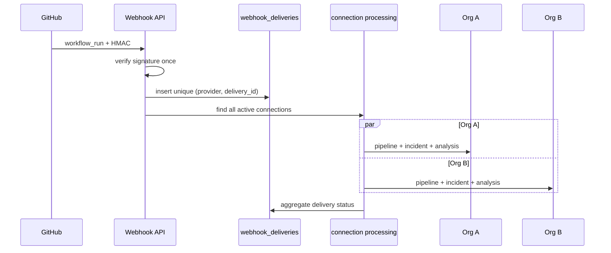

# GitHub Webhook Multi-Tenant Routing

## Goal

One GitHub webhook delivery for a shared repository must create **independent** DevGuard records for every authorized active connection.

## Flow

## Matching connections

For `workflow_run.completed`:

- `github_repository_id` matches delivery repository
- connection live (`disconnected_at` null, `is_active`, not paused)
- installation numeric id matches (when present)
- installation status ACTIVE
- organization access status ACTIVE (via `installation_access_id`)

## Per-connection idempotency

Table: `webhook_delivery_connection_processing`  
Unique: `(webhook_delivery_id, repository_connection_id)`

Statuses: `pending`, `processing`, `complete`, `failed`, `skipped`, `retryable`

Replay of the same `X-GitHub-Delivery` does not create a second incident for a connection that already completed.

## Delivery aggregation

External delivery uniqueness remains `(provider, delivery_id)`.

After fan-out:

- any retryable failure → delivery retryable/failed as appropriate;
- else any complete → delivery completed;
- else all skipped/ignored → delivery ignored.

`organization_id` / singular `related_*` on the delivery row are not the multi-tenant source of truth; per-connection processing rows are.

## Isolation guarantees

- Org A resolving an incident never affects Org B.
- Org A connection failure does not prevent Org B processing.
- Activity feeds are scoped through connection processing, not raw repository id alone.
