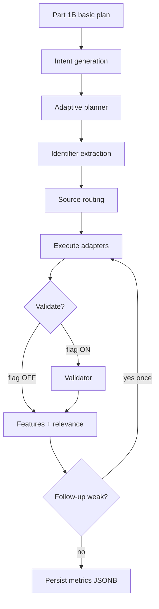

# Phase 6A.5 — Adaptive Hypothesis-Directed Retrieval

**Status:** Part 2 implemented  
**Migration:** none (016 not required)  
**Master flag:** `ADAPTIVE_HYPOTHESIS_RETRIEVAL_ENABLED` (default OFF)

When OFF, Part 1B path is unchanged. When ON:

Pipeline version becomes `hypothesis_directed_v2`; plan version `retrieval_plan_v2`.

**Non-goals:** causal ranking, second RAG engine, migration 016.
