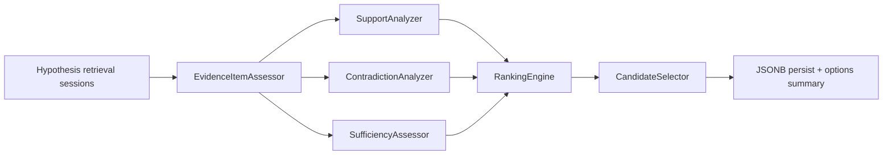

# Phase 6A.5 Part 3 — Evidence Assessment

Version: `evidence_assessment_v1`

## Purpose

Assess retrieved evidence items against each causal hypothesis as **candidates only**.

Does **not** prove root cause, generate remediations, run verifiers, abstain, or emit final diagnosis.

## Flags (all default OFF)

| Flag | Role |
|------|------|
| `HYPOTHESIS_EVIDENCE_ASSESSMENT_ENABLED` | Master gate |
| `EVIDENCE_SUFFICIENCY_ENABLED` | Sufficiency levels |
| `CONTRADICTION_ANALYSIS_ENABLED` | Contradiction candidates + penalty |
| `HYPOTHESIS_RANKING_ENABLED` | Cross-hypothesis RankingScore |
| `CANDIDATE_SELECTION_ENABLED` | Top / tie / weak selection |

When the master flag is OFF, Part 1B/Part 2 behaviour is unchanged.

## Pipeline

## Assessment types (frozen)

`SUPPORT_CANDIDATE` · `CONTRADICTION_CANDIDATE` · `CONTEXT_ONLY` · `INSUFFICIENT` · `AMBIGUOUS` · `UNRELATED`

Never: PROVEN / VERIFIED / TRUE / FALSE.

## Persistence (no migration 016)

- `hypothesis_retrieval_sessions.metrics["evidence_assessment"]`
- `hypothesis_retrieval_runs.configuration_snapshot["evidence_assessment"]`
- `context.options["hypothesis_evidence_assessment"]` (summary only)

## Related docs

- [`PHASE6A5_SUPPORT_ANALYSIS.md`](PHASE6A5_SUPPORT_ANALYSIS.md)
- [`PHASE6A5_CONTRADICTION_ANALYSIS.md`](PHASE6A5_CONTRADICTION_ANALYSIS.md)
- [`PHASE6A5_RANKING.md`](PHASE6A5_RANKING.md)
- [`PHASE6A5_CANDIDATE_SELECTION.md`](PHASE6A5_CANDIDATE_SELECTION.md)
- [`PHASE6A5_PART3_EVIDENCE_ASSESSMENT_AUDIT.md`](PHASE6A5_PART3_EVIDENCE_ASSESSMENT_AUDIT.md)
