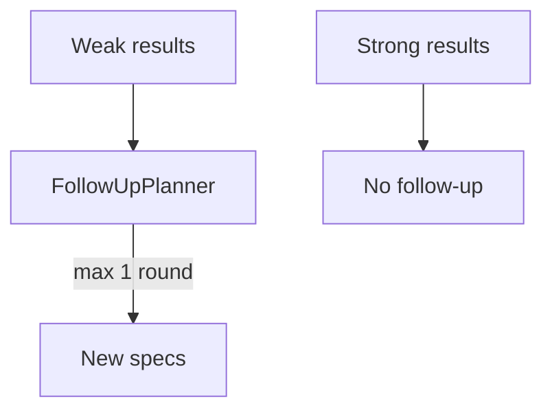

# Phase 6A.5 — Follow-Up Retrieval

Version: `hypothesis_follow_up_v1`

Triggers: below min results/relevance, missing required sources, no exact ID match, missing expected observation, open-set unknown. Never removes org scope.
