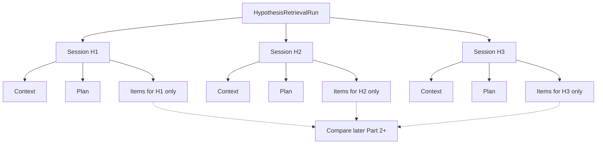

# Phase 6A.5 Part 1B — Hypothesis Retrieval Contracts

**Status:** Delivered (infrastructure only)  
**Versions:** `retrieval_context_v1` · `retrieval_plan_v1` · `hypothesis_directed_v1`

## Scope

Part 1B creates **contracts, adapters, sessions, and persistence** for hypothesis-directed retrieval. It does **not** implement causal ranking, proven support/contradiction analysis, remediations, or verifiers.

## Non-claims (binding)

| Label / outcome | Meaning in Part 1B |
|-----------------|-------------------|
| `SUPPORT_CANDIDATE` | Candidate relation only — **not** proven support |
| `CONTRADICTION_CANDIDATE` | Candidate relation only — **not** proven contradiction |
| Empty / failed retrieval | Lowers evidence availability — **does not disprove** a hypothesis |
| Retrieved item | Evidence **candidate** scoped to one hypothesis session |
| Identical KB hit for H1 and H2 | Remains **hypothesis-scoped** (separate sessions/items) |

## Domain packages

| Layer | Path |
|-------|------|
| Enums / models | `backend/app/domain/hypothesis_retrieval/` |
| Orchestrator / builders / adapters | `backend/app/ai/hypothesis_retrieval/` |
| ORM | `backend/app/infrastructure/database/models/hypothesis_retrieval.py` |
| Migration | `015_phase6a5_hyp_retrieval` |

## Per-hypothesis retrieval sessions

Bad: one shared retrieval for all hypotheses.  
Good: independent sessions, then compare later.

## Core enums

**Run status:** `PENDING`, `RUNNING`, `COMPLETE`, `PARTIAL`, `NO_EVIDENCE`, `FAILED`, `TIMED_OUT`, `DISABLED`

**Session status:** `PENDING`, `PLANNED`, `RETRIEVING`, `COMPLETE`, `PARTIAL`, `NO_EVIDENCE`, `FAILED`, `TIMED_OUT`, `SKIPPED`

**Source types:** `ARTIFACT`, `GRAPH`, `TEMPORAL`, `STATIC_KNOWLEDGE`, `VECTOR_KNOWLEDGE`, `LEXICAL_KNOWLEDGE`, `HISTORICAL_INCIDENT`, (+ reserved: `DOCUMENTATION`, `CLASSIFICATION`, `REPOSITORY_CHANGE`)

**Query types:** `CAUSAL_CLAIM`, `ERROR_SIGNATURE`, `ARTIFACT_REFERENCE`, `RESOURCE_REFERENCE`, `PERMISSION_ACTION`, `FAILURE_CATEGORY`, `EXPECTED_OBSERVATION`, `FALSIFYING_OBSERVATION`, `HISTORICAL_SIMILARITY`, `GRAPH_NEIGHBORHOOD`, `CUSTOM_RULE`

**Item relations:** `SUPPORT_CANDIDATE`, `CONTRADICTION_CANDIDATE`, `CONTEXT`, `UNKNOWN` — never conclusive `SUPPORTS` / `CONTRADICTS` in Part 1B.

## Feature flags

| Flag | Default | Role |
|------|---------|------|
| `HYPOTHESIS_DIRECTED_RAG_ENABLED` | false | Master gate |
| `MULTI_QUERY_RETRIEVAL_ENABLED` | false | Multiple query specs per session |
| `HYPOTHESIS_GRAPH_CONTEXT_ENABLED` | false | Graph adapter / graph queries |
| `CAUSAL_RANKING_ENABLED` | false | Reserved — **unused** in Part 1B |
| `HYPOTHESIS_HISTORICAL_RETRIEVAL_ENABLED` | true | Historical similarity query path |
| `HYPOTHESIS_STATIC_KB_RETRIEVAL_ENABLED` | true | Static/vector/lexical knowledge |
| `HYPOTHESIS_ARTIFACT_RETRIEVAL_ENABLED` | true | Artifact adapter |
| `HYPOTHESIS_RETRIEVAL_PERSISTENCE_ENABLED` | true | Persist runs/sessions/items |
| `RETRIEVAL_CACHE_ENABLED` | true | In-process query cache |

## Related docs

- [`PHASE6A5_RETRIEVAL_CONTEXT.md`](PHASE6A5_RETRIEVAL_CONTEXT.md)
- [`PHASE6A5_RETRIEVAL_ORCHESTRATOR.md`](PHASE6A5_RETRIEVAL_ORCHESTRATOR.md)
- [`PHASE6A5_RETRIEVAL_PERSISTENCE.md`](PHASE6A5_RETRIEVAL_PERSISTENCE.md)
- [`PHASE6A5_RETRIEVAL_AUDIT.md`](PHASE6A5_RETRIEVAL_AUDIT.md)
