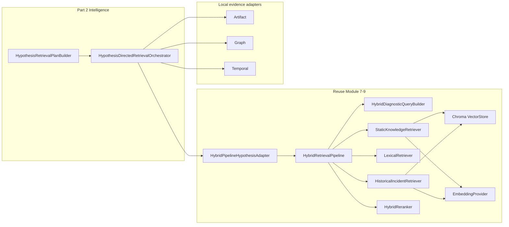

# Phase 6A.5 Part 2 — Retrieval Intelligence Audit

**Status:** Binding audit for Part 2 implementation  
**Date:** 2026-07-31  
**Alembic head:** `015_phase6a5_hyp_retrieval`  
**Migration 016 decision:** **NO — not required**

Part 2 persists intelligence payloads in existing JSONB columns only:
`plan_snapshot`, `context_snapshot`, `session.metrics`, `item_metadata`,
`configuration_snapshot`, and `query_specs[].metadata`.

Insertion point remains `_maybe_run_phase6a5_hypothesis_retrieval`.

---

# Phase 6A.5 Part 2 — Retrieval Intelligence Audit (from Part 1B)

**Status:** Audit only — no implementation  
**Date:** 2026-07-31  
**Scope:** Phase 6A.5 Part 1B hypothesis-directed retrieval → gaps and extension plan for Part 2 (retrieval intelligence)  
**Alembic head:** `015_phase6a5_hyp_retrieval`  
**Migration 016 required?** **No** (preferred)

**Scientific framing (unchanged):** Evidence competes. Hypotheses compete. Not prompts.

**Part 2 intent (this audit):** Make per-hypothesis retrieval *directed* — query intents, source routing, identifier-aware constraints, validation, relevance signals, and bounded follow-up — while **reusing** Module 7–9 `HybridRetrievalPipeline` / Chroma / embeddings. **Not** causal ranking (reserved `CAUSAL_RANKING_ENABLED` / Phase 6A.6+).

---

## 1. Verdict

Part 1B delivered a correct **foundation**: per-hypothesis sessions, context/plan/adapters/persistence, soft-fail insertion after 6A.4, and a thin wrap of `HybridRetrievalPipeline`. Retrieval **intelligence** is still minimal:

| Area | Part 1B reality |
|------|-----------------|
| Query generation | Fixed priority rules; mostly free-text dumps of hypothesis fields |
| Default execution | `MULTI_QUERY_RETRIEVAL_ENABLED=false` → **single query** (usually `q_causal_claim`) |
| KB path | Override string only; structured `DiagnosticQuery` signals still come from **analysis-level / rank-1** extractors |
| Plan constraints | Stored on `HypothesisRetrievalPlan` but **not applied** as Chroma `where` / lexical exact IDs |
| Relations | Candidate labels only (`SUPPORT_CANDIDATE` / `CONTRADICTION_CANDIDATE` / `CONTEXT`) — correct non-claim |
| Persistence | Migration 015 JSONB columns are sufficient for Part 2 payloads |

**Recommendation:** Implement Part 2 as **deterministic plan/query intelligence + optional soft filters into the existing hybrid path**, persisted in existing JSONB — **no migration 016**, **no second RAG engine**.

---

## 2. Insertion point confirmation

**Confirmed wired** in `AnalysisExecutionService.execute`:

```text
AnalysisOrchestrator.run(...)          # Modules 6–9 baseline RAG/diagnosis
→ _maybe_persist_artifact_bundle       # 6A.1–6A.2
→ _maybe_run_phase6a3                  # hierarchical classification
→ _maybe_run_phase6a4                  # competing causal hypotheses
→ _maybe_run_phase6a5_hypothesis_retrieval   # Part 1B / Part 2 home
→ _persist_results
```

| Detail | Location |
|--------|----------|
| Hook | `backend/app/application/services/analysis_execution_service.py` → `_maybe_run_phase6a5_hypothesis_retrieval` |
| Master gate | `settings.hypothesis_directed_rag_enabled` (default **false**) |
| Soft-fail | Exceptions → warning + `context.options["hypothesis_directed_retrieval"]`; does **not** overwrite `retrieved_chunks` / diagnosis |
| Pipeline reuse | `build_hybrid_pipeline(...)` then `HypothesisDirectedRetrievalOrchestrator(..., hybrid_pipeline=...)` |
| Orchestrator | `backend/app/ai/hypothesis_retrieval/orchestrator.py` → `HypothesisDirectedRetrievalOrchestrator.run` |

Part 2 **must stay** in this hook and orchestrator. Do not move hypothesis RAG into Module 7–9 `AnalysisOrchestrator`.

---

## 3. Part 1B inventory (what exists)

### 3.1 Domain

| Path | Role |
|------|------|
| `backend/app/domain/hypothesis_retrieval/enums.py` | Statuses, source types, query types, relations, modes, failure types |
| `backend/app/domain/hypothesis_retrieval/models.py` | Context / plan / query spec / item / session / run; version constants |

**Versions today:**

- `CONTEXT_VERSION = "retrieval_context_v1"`
- `PLAN_VERSION = "retrieval_plan_v1"`
- `RETRIEVAL_PIPELINE_VERSION = "hypothesis_directed_v1"`
- `TRUNCATION_RULE_VERSION = "truncation_v1"`

### 3.2 AI package

| Path | Class / function |
|------|------------------|
| `.../plan_builder.py` | `HypothesisRetrievalPlanBuilder`, `normalize_query_text`, `is_secret_like_query` |
| `.../context_builder.py` | `HypothesisRetrievalContextBuilder` |
| `.../orchestrator.py` | `HypothesisDirectedRetrievalOrchestrator`, `is_hypothesis_eligible_for_retrieval` |
| `.../cache.py` | `build_retrieval_cache_key`, `InMemoryRetrievalCache` |
| `.../dedupe.py` | `deduplicate_session_items`, `normalized_content_hash` |
| `.../persist.py` | `HypothesisRetrievalPersistService` |
| `.../adapters/hybrid.py` | `HybridPipelineHypothesisAdapter` |
| `.../adapters/artifact.py` | `ArtifactEvidenceRetrievalAdapter` |
| `.../adapters/graph.py` | `GraphEvidenceRetrievalAdapter` |
| `.../adapters/temporal.py` | `TemporalEvidenceRetrievalAdapter` |
| `.../adapters/base.py` | `HypothesisRetrievalAdapter` protocol |

### 3.3 Persistence / API

| Path | Role |
|------|------|
| `backend/alembic/versions/015_phase6a5_hyp_retrieval.py` | Tables for runs/sessions/queries/items/junction |
| `backend/app/infrastructure/database/models/hypothesis_retrieval.py` | ORM |
| `backend/app/application/services/phase6a5_service.py` | Debug read APIs |
| `backend/app/schemas/phase6a5.py` | Response DTOs (opaque `snapshot` / `metrics`) |

### 3.4 Config (`backend/app/core/config.py`, Phase 6A.5 section)

| Flag | Default | Notes |
|------|---------|-------|
| `HYPOTHESIS_DIRECTED_RAG_ENABLED` | false | Master |
| `MULTI_QUERY_RETRIEVAL_ENABLED` | false | Caps plan to 1 query |
| `HYPOTHESIS_GRAPH_CONTEXT_ENABLED` | false | Graph sources / adapter |
| `HYPOTHESIS_HISTORICAL_RETRIEVAL_ENABLED` | true | Historical query + hybrid historical path gate |
| `HYPOTHESIS_STATIC_KB_RETRIEVAL_ENABLED` | true | STATIC/VECTOR/LEXICAL source types |
| `HYPOTHESIS_ARTIFACT_RETRIEVAL_ENABLED` | true | Artifact adapter |
| `HYPOTHESIS_RETRIEVAL_PERSISTENCE_ENABLED` | true | Persist |
| `RETRIEVAL_CACHE_ENABLED` | true | In-process hybrid cache |
| `CAUSAL_RANKING_ENABLED` | false | **Must remain unused** in Part 2 |
| Bounds | various | `max_hypotheses_for_retrieval=5`, `max_queries_per_hypothesis=6`, etc. |
| `MAX_HISTORICAL_INCIDENTS_PER_HYPOTHESIS` | 10 | **Defined but unused** in orchestrator/adapters |

---

## 4. Current basic query rules (`HypothesisRetrievalPlanBuilder`)

**File:** `backend/app/ai/hypothesis_retrieval/plan_builder.py`  
**Entry:** `HypothesisRetrievalPlanBuilder.build(context, session_id=...)`

### 4.1 Rule table (priority ascending = earlier in sort)

| Priority | `query_id` | `RetrievalQueryType` | Text source | Default `source_types` | `expected_relation` |
|----------|------------|----------------------|-------------|------------------------|---------------------|
| 10 | `q_causal_claim` | `CAUSAL_CLAIM` | `context.causal_claim` | knowledge* + artifact† + `TEMPORAL` | `SUPPORT_CANDIDATE` |
| 20 | `q_error_signature` | `ERROR_SIGNATURE` | `error_signature` (if set) | knowledge* + `TEMPORAL` | `SUPPORT_CANDIDATE` |
| 30 | `q_failure_category` | `FAILURE_CATEGORY` | join of category / L1–L3 / `title` | knowledge* only | `CONTEXT` |
| 40 | `q_artifact_reference` | `ARTIFACT_REFERENCE` | `affected_artifact_id` + `affected_path` + `title` | artifact† + knowledge* | `CONTEXT` |
| 45 | `q_graph_neighborhood` | `GRAPH_NEIGHBORHOOD` | root/observed labels + claim[:120] | graph‡ + artifact† + `TEMPORAL` | `CONTEXT` |
| 50–51 | `q_permission_action_{1,2}` | `PERMISSION_ACTION` | first **2** `permission_actions` | knowledge* + artifact† + graph‡ | `SUPPORT_CANDIDATE` |
| 60–61 | `q_resource_{1,2}` | `RESOURCE_REFERENCE` | first **2** `resource_identifiers` | artifact† + graph‡ + knowledge* | `CONTEXT` |
| 70 | `q_expected_observation` | `EXPECTED_OBSERVATION` | **only** `expected_observations[0]` | artifact† + `TEMPORAL` + knowledge* | `SUPPORT_CANDIDATE` |
| 75 | `q_falsifying_observation` | `FALSIFYING_OBSERVATION` | **only** `falsifying_observations[0]` | same | `CONTRADICTION_CANDIDATE` |
| 90 | `q_historical_similarity` | `HISTORICAL_SIMILARITY` | category + error_signature + claim[:240] | `HISTORICAL_INCIDENT` only | `CONTEXT` |

\* `_knowledge_sources()` → `STATIC_KNOWLEDGE`, `VECTOR_KNOWLEDGE`, `LEXICAL_KNOWLEDGE` if `static_kb_enabled`  
† if `artifact_enabled`  
‡ if `graph_context_enabled`

### 4.2 Acceptance / bounding logic

1. `_maybe_spec` → empty text → drop; mask secrets; truncate to `max_query_chars` (default 2000).  
2. Reject: empty normalized, oversized, secret-like, empty `source_types`.  
3. Dedupe by `normalized_query` (whitespace-collapsed, lowercased, masked).  
4. Sort by `(priority, query_id)`.  
5. If **`multi_query_enabled` is false** → keep **`accepted[:1]`** and warn `multi_query_disabled_single_query_mode`.  
6. Else cap to `max_queries` (default 6).  
7. Build plan-level `enabled_source_types` / `excluded_source_types`, constraint dicts, `plan_key` = SHA-256 prefix of `hypothesis_id:PLAN_VERSION:query_ids`.

### 4.3 What the rules are *not*

- No intent taxonomy (verify / falsify / locate / compare / history).  
- No adaptive follow-up queries based on empty/weak results.  
- No quality gate on claim length / specificity before issuing KB queries.  
- No use of `missing_evidence`, `proposed_verification_steps`, classification disagreement, or open-set status in query text.  
- `CUSTOM_RULE` enum exists but is unused.

---

## 5. Current source selection

### 5.1 Plan-time

Source lists are **static per rule** (table above), gated only by builder flags from Settings. There is **no** routing by category family, critic decision, missing evidence type, or source availability.

Reserved types `DOCUMENTATION`, `CLASSIFICATION`, `REPOSITORY_CHANGE` are never enabled; they are also omitted from the “excluded” list so they do not appear as explicitly excluded.

### 5.2 Run-time (`HypothesisDirectedRetrievalOrchestrator._adapters_for_sources`)

| Source types on spec | Adapter |
|----------------------|---------|
| `ARTIFACT` | `ArtifactEvidenceRetrievalAdapter` |
| `GRAPH` | `GraphEvidenceRetrievalAdapter` |
| `TEMPORAL` | `TemporalEvidenceRetrievalAdapter` (**always constructed with `enabled=True`**) |
| `STATIC_*` / `VECTOR_*` / `LEXICAL_*` / `HISTORICAL_INCIDENT` | **one** `HybridPipelineHypothesisAdapter` |

Adapter order: artifact → graph → temporal → hybrid.

**Gaps for Part 2:**

- Specs often request VECTOR + STATIC + LEXICAL together, but hybrid returns a **merged** candidate list; source mapping is post-hoc heuristic (`_map_source_type` in `adapters/hybrid.py`).  
- Historical-only specs still go through the same hybrid pipeline mode resolution as static (depends on analysis `options` / settings), not a dedicated “history only” mode override.  
- No skip of hybrid when query is identifier-only (better served by artifact/graph/lexical exact).

---

## 6. Weak generic queries

| Pattern | Why weak |
|---------|----------|
| Default single query = full causal claim | Long prose embeddings; low lexical exactness; duplicates across similar hypotheses |
| Category query = codes + title string | Soft category scoring in hybrid only if `DiagnosticQuery.failure_category` matches — and that field is **still rank-1 derived** (see §8) |
| Expected/falsifying = first list item only | Ignores remaining observations; no structured “must observe X in artifact Y” |
| Graph neighborhood = labels + claim slice | Free text; graph adapter already has structured nodes — KB path gets little from this |
| Permission/resource as bare strings | Not injected into `DiagnosticQuery.error_codes` / lexical exact tokens |
| Historical query = category + signature + claim[:240] | Reasonable shape, but unused `max_historical_incidents_per_hypothesis`; org filter OK inside historical retriever |

**Net effect with defaults:** Part 1B often runs **one** embedding/hybrid search on the causal claim, plus local artifact/temporal adapters when those sources are listed on that single spec — not a directed multi-probe plan.

---

## 7. Missing hypothesis-specific constraints

`HypothesisRetrievalPlan` already carries:

- `graph_constraints` — root / observed / causal path node IDs  
- `artifact_constraints` — affected artifact/path  
- `repository_constraints` — commit_sha, workflow_path  
- `time_constraints` — temporal_primary_event_id  

`HypothesisRetrievalQuerySpec` already carries:

- `target_category`, `target_paths`, `target_actions`, `target_resource_identifiers`, `graph_node_ids`, `target_artifact_types` (field exists, **never populated** by builder)

**Consumption today:**

| Consumer | Uses constraints? |
|----------|-------------------|
| `HybridPipelineHypothesisAdapter.retrieve` | Sets `options["hypothesis_directed_query"]` + `top_k` only. Cache key uses `affected_artifact_id` only. **No** category/path/action filters into Chroma. |
| `ArtifactEvidenceRetrievalAdapter` | Soft token overlap on needle; always includes affected artifact |
| `GraphEvidenceRetrievalAdapter` | Uses `graph_node_ids` + context seeds; still weak text needle filter |
| `TemporalEvidenceRetrievalAdapter` | Soft token overlap; always includes primary failure summary |

Plan constraints are therefore **documentary** for the KB path, not operational filters.

---

## 8. Missing exact identifier use

Context builder **does** collect:

- `permission_actions` (signals + evidence links + graph node metadata)  
- `resource_identifiers` (graph metadata ARNs / resource ids)  
- `error_signature` (signals / temporal failure type)  
- `changed_files`, `affected_path`, `commit_sha`

Plan builder turns at most two actions/resources into **free-text** query specs.

**Not done:**

- Pass identifiers into `DiagnosticQuery.error_codes` / `commands` / `resource_types` / `keywords` so `LexicalRetriever.search` can exact-boost.  
- Prefer lexical-first / exact path when query type is `PERMISSION_ACTION` or `RESOURCE_REFERENCE`.  
- Hard-filter or boost Chroma metadata for known error codes when chunk metadata contains them.  
- Use `commit_sha` / `workflow_path` as retrieval constraints (only cache key / item fields).

---

## 9. Rank-1 assumptions (critical)

Baseline Module 6–9 RAG is rank-1-centric. Part 1B **partially** escapes it (per-hypothesis text override) but **reimports** rank-1 via structured signals.

### 9.1 Where rank-1 still wins

| Location | Behavior |
|----------|----------|
| `HybridDiagnosticQueryBuilder.build` | Always runs `DiagnosticSignalExtractor.extract(context)` |
| `DiagnosticSignalExtractor.extract` | `failure_category = context.classifications[0].category_code` |
| `_semantic_parts` (non-override path) | Uses `classifications[0].root_cause_summary` |
| Override path | Replaces **text** only; `DiagnosticQuery.failure_category` / technologies / error_codes still from analysis-level extraction |

Then:

- `StaticKnowledgeRetriever._apply_structured_scores` uses `query.failure_category` for category boost/penalty.  
- `LexicalRetriever.search` boosts `query.error_codes`, etc., from **analysis text**, not hypothesis claim.  
- `HybridReranker` reasons like “same failure category” refer to **rank-1 category**, not `query_spec.target_category`.

### 9.2 Hypothesis category is underused

Plan sets `target_category=context.category_code` on causal/category/historical specs, but hybrid adapter never copies that into `DiagnosticQuery.failure_category` or options.

**Part 2 requirement:** For hypothesis-directed hybrid calls, structured query fields must be derived from **`HypothesisRetrievalContext` / query spec**, not silently from `classifications[0]`.

---

## 10. Metadata-filter weaknesses

### 10.1 Static / vector path

`StaticKnowledgeRetriever.retrieve` (`backend/app/ai/rag/static_retriever.py`):

```text
where = {"document_status": {"$eq": "active"}}
```

No hard filter on failure category, technology, provider, path, or org (KB is global curated docs — acceptable), but also **no soft preference injected from hypothesis `target_category`** beyond whatever rank-1 category already put on `DiagnosticQuery`.

Technologies are explicitly **not** hard-filtered (`pass` comment).

### 10.2 Historical path

`HistoricalIncidentRetriever.retrieve` correctly hard-filters:

- `document_status=active`  
- `source_type=historical_incident`  
- `organisation_id` (tenant boundary — do not soften)

Still no hypothesis category hard-filter; category is soft via `_list_overlap_score` against rank-1 `failure_category`.

### 10.3 Baseline `KnowledgeRetriever`

`_metadata_filters` in `retriever.py` also only returns `document_status=active` (context unused).

### 10.4 Part 2 guidance

Prefer **soft boosts + post-filters** over aggressive Chroma hard filters on small KB. Safe hard filters: org (history), `document_status`, optionally `source_type` when routing historical-only. Soft: category / path / action overlap from **hypothesis** fields.

---

## 11. Current cache behavior

**Files:** `cache.py`, used by `HybridPipelineHypothesisAdapter` only.

### 11.1 Key (`build_retrieval_cache_key`)

Includes: `organization_id`, `project_id`, `knowledge_base_version` (hardcoded `"kb_v1"` in adapter), `embedding_model_version`, `adapter_name`/`version`, `normalized_query`, sorted `source_filters`, `repository_commit`, `artifact_constraints` (**only** `affected_artifact_id`), `top_k`, `plan_version`.

**Omits:** `hypothesis_id`, `query_id`, `query_type`, `target_category`, paths/actions/resources, graph constraints, retrieval mode, weight profile hash.

### 11.2 Store

`InMemoryRetrievalCache`: process-local, TTL 600s, max 256 entries, oldest-by-expiry eviction, thread lock.

### 11.3 Implications

- Cross-hypothesis reuse of identical normalized query text is **allowed** (items re-cloned with new `hypothesis_id` / `query_id`) — OK for identical text, **dangerous** if Part 2 adds hypothesis-specific filters without adding them to the cache key.  
- Enabling multi-query + intelligence without key updates can serve wrong filtered results.  
- Artifact/graph/temporal adapters are **uncached**.

**Part 2:** Extend cache key with intent id, structured filter fingerprint, and pipeline/mode/profile versions; or disable cache when filters differ from key.

---

## 12. Migration 015 extensibility — **No migration 016**

### 12.1 Decision

**Do not create migration 016** for Part 2 retrieval intelligence.

015 already provides JSONB (and version string columns) that can hold intents, routing, validation, relevance, and follow-up without schema changes.

### 12.2 What goes where

| Part 2 data | Preferred store | Why |
|-------------|-----------------|-----|
| Query intents, routing decisions, constraint fingerprints, rule ids | `hypothesis_retrieval_sessions.plan_snapshot` → especially `query_specs[].metadata` and plan-level keys (`cache_policy`, new `intelligence` object) | Plan is the authoritative “what we asked”; already versioned via `retrieval_plan_version` / `plan_version` |
| Full context used for intelligence (already) | `context_snapshot` | Already complete context dump via `HypothesisRetrievalContext.to_dict()` |
| Per-query validation / weak-result / follow-up triggers | `sessions.metrics["query_intelligence"][query_id]` **and/or** `plan_snapshot` | **No** `execution_metadata` column on `hypothesis_retrieval_query_executions`; avoid 016 by nesting under metrics or plan |
| Session-level follow-up plan, relevance summary, coverage gaps | `sessions.metrics` + `sessions.warnings` | Metrics already free-form dict; warnings already JSONB list |
| Item relevance / support strength candidates / match features | `hypothesis_retrieved_items.item_metadata` | Already merges adapter metadata + associations in `persist.py` |
| Run-level intelligence config | `hypothesis_retrieval_runs.configuration_snapshot` | Already stores flags; add Part 2 version strings / feature toggles |
| Pipeline version bump | `retrieval_pipeline_version` column (string) | No schema change — write new version string |

### 12.3 Query execution row limitation (documented, not blocking)

`HypothesisRetrievalQueryExecutionRow` has: status, adapters, counts, cache_hit, timings, `warnings`, `error_summary` — **no metadata JSONB**.

**Workaround (no 016):** Persist rich per-query intelligence in:

1. `plan_snapshot.query_specs[i].metadata`, and  
2. `session.metrics["query_intelligence"][query_id]`,  

and keep SQL query rows as operational telemetry. Debug APIs already return plan snapshot + session metrics as opaque dicts (`phase6a5.py`).

### 12.4 When 016 *would* be justified (out of Part 2 preferred path)

Only if product requires indexed SQL filters on intent enums / relevance scores. Prefer JSONB until ranking (6A.6+) needs first-class columns.

---

## 13. Exact classes to extend vs must remain unchanged

### 13.1 Extend (Part 2 primary)

| Class / module | Extension role |
|----------------|----------------|
| `HypothesisRetrievalPlanBuilder` | Intent-aware rules, identifier queries, hypothesis category wiring into specs.metadata, smarter multi-query selection |
| Domain models in `models.py` | Optional new dataclasses / fields on specs (defaults only); bump version constants |
| `enums.py` | Add intent / validation enums if needed (`StrEnum` additive) |
| `HybridPipelineHypothesisAdapter` | Pass hypothesis-scoped structured options into context copy; fix `DiagnosticQuery` category/signals; apply soft filters; cache key fingerprint |
| `HypothesisDirectedRetrievalOrchestrator._execute_session_sync` | Optional bounded follow-up queries; write metrics intelligence; still no ranking |
| `deduplicate_session_items` | Preserve new metadata keys when merging |
| `InMemoryRetrievalCache` / `build_retrieval_cache_key` | Include intelligence fingerprint |
| Artifact / graph / temporal adapters | Stronger exact-ID matching using `target_*` fields |
| `Settings` (config) | Additive Part 2 flags (default off) if needed — not ranking |
| `HypothesisRetrievalPersistService` | Only if domain adds fields already mapped into existing JSONB (no new columns) |
| Tests under `backend/tests/test_phase6a5_*.py` | Coverage for intents / filters / no rank-1 leak |

### 13.2 Extend carefully (shared RAG — additive, backward compatible)

| Class | Allowed change | Forbidden |
|-------|----------------|-----------|
| `HybridDiagnosticQueryBuilder` | Read optional options keys for hypothesis-directed structured fields when override present | Changing default Module 7–9 single-query behavior when options absent |
| `StaticKnowledgeRetriever` | Optional soft where / scoring hooks driven by query fields already on `DiagnosticQuery` | Breaking embedding_only baseline |
| `LexicalRetriever` | Boost additional identifier lists already on `DiagnosticQuery` | External search service |
| `HistoricalIncidentRetriever` | Soft category from query (still org-hard-filter) | Softening org filter |
| `HybridReranker` / `HybridRetrievalScorer` | Use existing score channels | New second scorer product |
| `HybridRetrievalPipeline` | Optional mode override via `context.options` for hypothesis sessions | Forking a parallel pipeline class |

### 13.3 Must remain unchanged (Part 2)

| Asset | Reason |
|-------|--------|
| `AnalysisOrchestrator` Module 7–9 RAG order / flat `retrieved_chunks` diagnosis path | Baseline must not regress |
| Soft-fail hook contract in `_maybe_run_phase6a5_hypothesis_retrieval` | Isolation |
| `CAUSAL_RANKING_ENABLED` unused | Ranking deferred |
| Non-claims: no proven SUPPORTS/CONTRADICTS | Contracts doc |
| Migration 015 table shapes | Prefer JSONB |
| Chroma service / embedding provider defaults / hash≠ST silent fallback | Step 3–4 infra |
| `Phase6A5HypothesisRetrievalService` auth/scoping patterns | Read APIs; snapshots remain opaque |
| Eligibility helper semantics for excluded statuses | Stability of who gets sessions |

### 13.4 Do **not** create

- Second RAG engine / duplicate Chroma client stack  
- Parallel “hypothesis vector store”  
- LLM query rewriter as the primary path (deterministic rules first; LLM deferred to later modules)  
- Proven contradiction engine / remediations / verifiers (later phases)

---

## 14. Reuse plan — no second RAG engine



| Capability | Reuse |
|------------|-------|
| Embeddings | Existing `EmbeddingProvider` via `build_hybrid_pipeline` |
| Vector store | Existing Chroma / in-memory `VectorStore` |
| Hybrid scoring / rerank / diversity / dedupe | `HybridReranker`, profiles in `weight_profiles.py` |
| Lexical exact | `LexicalRetriever` — feed hypothesis identifiers into `DiagnosticQuery` |
| Historical org isolation | `HistoricalIncidentRetriever` as-is |
| Weight profiles | `hybrid_static_v1` / `hybrid_history_v1` / `embedding_baseline_v1` — optional **new named profile later** without removing old ones |
| Secret masking | `mask_secrets` / plan builder secret rejection |

Adapter already isolates caller context (`copy.copy`, fresh `retrieved_chunks`) — preserve that.

---

## 15. Insertion point confirmation (binding for Part 2)

| Check | Status |
|-------|--------|
| After 6A.4 hypotheses exist | Yes |
| Before `_persist_results` | Yes |
| Soft-fail / flag OFF = no-op | Yes |
| Does not overwrite baseline RAG chunks | Yes (`context.options["hypothesis_directed_retrieval"]` only) |
| Uses shared `HybridRetrievalPipeline` | Yes |
| Per-hypothesis sessions | Yes |
| Ranking | Explicitly out of scope |

Part 2 work lands inside `backend/app/ai/hypothesis_retrieval/**` + thin options plumbing into `HybridDiagnosticQueryBuilder` / adapter — **not** a new analysis stage.

---

## 16. Version strings Part 2 should introduce

Bump domain constants in `backend/app/domain/hypothesis_retrieval/models.py` (and persist into existing version columns / snapshots):

| Constant | Part 1B | Part 2 proposed | Notes |
|----------|---------|-----------------|-------|
| `CONTEXT_VERSION` | `retrieval_context_v1` | `retrieval_context_v1` **or** `retrieval_context_v2` only if context schema fields change | Prefer keep v1 if only consuming existing fields |
| `PLAN_VERSION` | `retrieval_plan_v1` | **`retrieval_plan_v2`** | Required when intents/routing land in plan_snapshot |
| `RETRIEVAL_PIPELINE_VERSION` | `hypothesis_directed_v1` | **`hypothesis_directed_v2`** | Marks intelligence-aware orchestrator/adapter behavior |
| `TRUNCATION_RULE_VERSION` | `truncation_v1` | keep unless truncation policy changes | — |
| Adapter versions | `v1` on hybrid/artifact/graph/temporal | **`v2`** on adapters that change retrieval semantics | Cache key already includes `adapter_version` |
| Optional plan intelligence schema key | — | `intelligence_schema_version: "retrieval_intelligence_v1"` inside `plan_snapshot` | Avoids extra constant if preferred nested |
| Optional weight profile | — | only if needed: e.g. `hybrid_hypothesis_v1` | Additive in `weight_profiles.py`; default still existing profiles |

Also stamp into:

- `HypothesisRetrievalRun.retrieval_pipeline_version` / ORM column  
- `session.retrieval_plan_version` / `plan_snapshot.plan_version`  
- `configuration_snapshot` (new Part 2 flags + versions)  
- Cache `plan_version` argument (already passed)

---

## 17. Recommended Part 2 work packages (implementation order)

1. **Hypothesis-scoped `DiagnosticQuery` wiring** in `HybridPipelineHypothesisAdapter` + `HybridDiagnosticQueryBuilder` options — eliminate rank-1 category leak when directed override is active.  
2. **Plan v2 intents + identifier rules** in `HypothesisRetrievalPlanBuilder` (still deterministic).  
3. **Apply `target_*` constraints** in local adapters; soft category/identifier boosts on hybrid path.  
4. **Validation + weak-result metrics** in orchestrator → `session.metrics` / warnings; optional single bounded follow-up query when multi-query enabled.  
5. **Cache key fingerprint** update.  
6. **Docs + tests**; leave `CAUSAL_RANKING_ENABLED` untouched.

---

## 18. Explicit non-goals (Part 2)

- Causal ranking / winner selection across hypotheses  
- Proven support/contradiction adjudication  
- Remediations, verifiers, PDF reports  
- SMTP / billing / Module 10 multi-agent prompts  
- Migration 016  
- Second RAG product path  
- Changing frozen failure taxonomy or org roles  

---

## 19. Related documents

- `docs/PHASE6A5_RETRIEVAL_AUDIT.md` (Part 1A + 1B status)  
- `docs/PHASE6A5_HYPOTHESIS_RETRIEVAL_CONTRACTS.md`  
- `docs/PHASE6A5_RETRIEVAL_CONTEXT.md`  
- `docs/PHASE6A5_RETRIEVAL_ORCHESTRATOR.md`  
- `docs/PHASE6A5_RETRIEVAL_PERSISTENCE.md`  

---

## 20. Audit checklist summary

| # | Topic | Finding |
|---|-------|---------|
| 1 | Plan builder rules | Fixed priority free-text rules; default single-query |
| 2 | Source selection | Static per-rule lists; one hybrid adapter for all KB/history |
| 3 | Weak generic queries | Causal-claim prose dominant; observations truncated to `[0]` |
| 4 | Hypothesis constraints | On plan/spec but unused on KB path |
| 5 | Exact identifiers | Collected; not fed to lexical/`DiagnosticQuery` |
| 6 | Rank-1 assumptions | Structured hybrid scores still use `classifications[0]` |
| 7 | Metadata filters | Essentially `document_status=active` (+ org for history) |
| 8 | Cache | In-memory hybrid-only; key omits hypothesis filters |
| 9 | Migration 016 | **Not required** — use JSONB snapshots/metrics/`item_metadata` |
| 10 | Extend vs freeze | Extend plan builder + hybrid adapter + thin query builder options; freeze baseline orchestrator RAG + ranking flag |
| 11 | Reuse | `HybridRetrievalPipeline`, embeddings, Chroma, lexical, historical |
| 12 | Insertion point | Confirmed after 6A.4 via `_maybe_run_phase6a5_hypothesis_retrieval` |