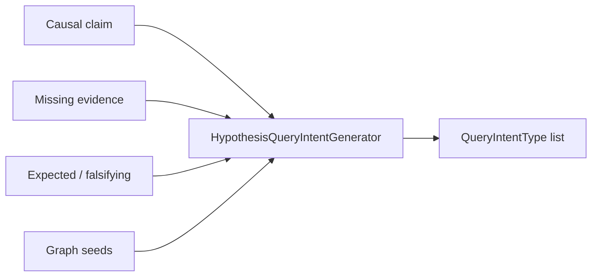

# Phase 6A.5 — Query Intents

Version: `hypothesis_query_intents_v1`

Intent types include confirm claim, contradiction candidate, missing evidence, artifact relationship, historical analogue, official constraint, policy behavior, configuration requirement, prior-success difference, exact signature, resource/permission relationship, and novel signature.
