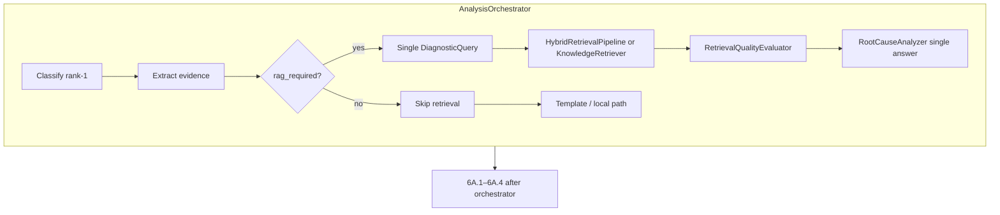
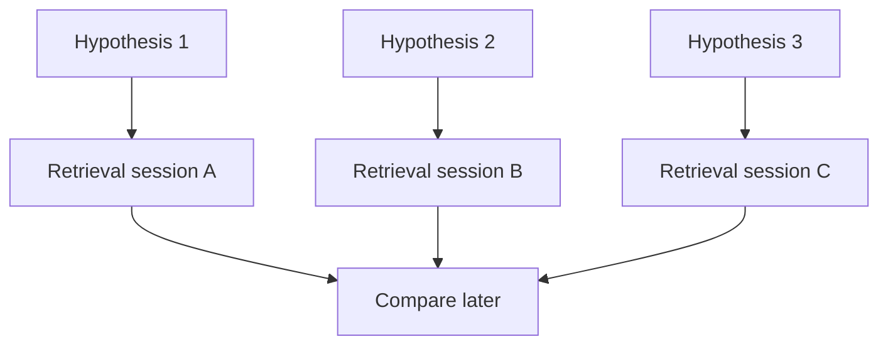

# Phase 6A.5 Part 1A — Hypothesis-Directed Retrieval Audit

**Status:** Complete (audit only — no implementation in Part 1A)  
**Date:** 2026-07-31  
**Alembic head at audit:** `014_phase6a4_hypotheses`  
**Next migration (Part 1B+, if needed):** `015_*` (not created in Part 1A)

**Explicit stop:** This document does **not** implement the retrieval orchestrator, retrieval context models, migrations, ranking, or APIs. Those belong to Part 1B+.

---

## 1. Verdict

Baseline Module 7–9 RAG is a mature **single-query** hybrid engine. Phase 6A.2–6A.4 outputs (temporal, graph, hierarchical classification, competing hypotheses) **do not feed** that engine today, because RAG runs **inside** `AnalysisOrchestrator` **before** those stages.

Phase 6A.5 must **extend** `HybridRetrievalPipeline` with hypothesis-scoped sessions after 6A.4 — **not** invent a second RAG product path.

Scientific framing for later parts:

> Evidence competes. Hypotheses compete. Not prompts.

---

## 2. Current runtime order (critical)

```text
AnalysisExecutionService.execute
  → AnalysisOrchestrator.run(...)     # Modules 6–9: classify → evidence → RAG → reason → fuse
  → _maybe_persist_artifact_bundle    # 6A.1 (+ 6A.2 temporal/graph inside)
  → _maybe_run_phase6a3               # hierarchical / open-set / disagreement
  → _maybe_run_phase6a4               # competing causal hypotheses
  → _persist_results
```

Ideal causal pipeline diagrams that place hypotheses before RAG are **aspirational**. As-built wiring is the opposite for Modules 6–9.

**Future Part 1B insertion point (document only):**

```text
  → _maybe_run_phase6a4
  → _maybe_run_phase6a5_hypothesis_retrieval   # NEW — soft-fail; flag OFF = no-op
  → _persist_results
```

When 6A.5 flags are OFF, Modules 6–9 diagnosis and baseline RAG remain unchanged.

---

## 3. Existing retrieval flow



| Step | Behavior |
|------|----------|
| Gate | Adaptive route `rag_required` + `ENABLE_RAG` + request `enable_rag` |
| Query | One string/query object from rank-1 category + root-cause summary + signals + evidence excerpts |
| Retrieve | Prefer hybrid pipeline; else baseline embedding retriever |
| Consume | Flat `context.retrieved_chunks` → single root-cause prompt |
| Persist | Flat `retrieved_documents` for the analysis (historical hits often citation-only) |

---

## 4. Component inventory

### 4.1 Orchestration

| Component | Path |
|-----------|------|
| Analysis orchestrator | `backend/app/ai/orchestration/analysis_orchestrator.py` |
| Execution service | `backend/app/application/services/analysis_execution_service.py` |
| Adaptive router | `backend/app/ai/orchestration/adaptive_router.py` |
| Budget manager | `backend/app/ai/orchestration/budget_manager.py` |
| Retrieval quality | `backend/app/ai/orchestration/retrieval_quality.py` |

### 4.2 RAG engine (reuse — do not duplicate)

| Component | Path |
|-----------|------|
| Factory | `backend/app/ai/factory.py` (`build_hybrid_pipeline`) |
| Hybrid pipeline | `backend/app/ai/rag/hybrid_pipeline.py` |
| Baseline retriever | `backend/app/ai/rag/retriever.py` |
| Static retriever | `backend/app/ai/rag/static_retriever.py` |
| Historical retriever | `backend/app/ai/rag/historical_retriever.py` |
| Historical index | `backend/app/ai/rag/historical_index.py` |
| Query builders | `hybrid_query_builder.py`, `query_builder.py`, `signals.py` |
| Scorer / rerank / diversity | `hybrid_scorer.py`, `hybrid_reranker.py`, `deduplicator.py`, `diversity.py` |
| Lexical index | `lexical_index.py` |
| Weight profiles | `weight_profiles.py` |
| Models | `models.py` (`DiagnosticQuery`, `RetrievalCandidate`, `RetrievalResult`) |
| Vector store | `vector_store.py` (Chroma + in-memory) |
| Embeddings | `embedding_provider.py`, `embedding_health.py` |
| Ingestion | `knowledge_ingestion.py`, `chunker.py`, `metadata_enrichment.py` |

### 4.3 Interfaces

`backend/app/domain/interfaces/ai_providers.py`:

- `EmbeddingProvider` — `embed` / `embed_query` / `embed_documents`
- `VectorStore` — `upsert` / `query(..., where=)`
- `ReasoningProvider` — `generate_root_cause(RootCauseRequest)` with **flat** `retrieved_docs`

### 4.4 Knowledge / persistence

| Artifact | Location |
|----------|----------|
| Curated docs | `knowledge_base/*.md` |
| PG documents/chunks | `knowledge_documents`, `knowledge_chunks` |
| Retrieved citations | `retrieved_documents` |
| Log evidence | `evidence_items` (upload-derived; not RAG) |
| Chroma | `chromadb/chroma:1.5.9`, collection `devguard_knowledge` (configurable) |

### 4.5 Reasoning / prompts

| Item | Path / note |
|------|-------------|
| Prompt builder | `backend/app/ai/reasoning/prompt_builder.py` (`PROMPT_VERSION=v1`) |
| Analyzer | `root_cause_analyzer.py` |
| Providers | `reasoning_provider.py` (local + OpenAI) |
| Schema bias | Single `root_cause` + free-text `alternative_causes` |

### 4.6 Phase 6A inputs available **after** 6A.4 (for Part 1B)

| Phase | Artifact | Feeds baseline RAG today? |
|-------|----------|---------------------------|
| 6A.1 | Artifact bundle + parsers | No |
| 6A.2 | Temporal + evidence graph | No |
| 6A.3 | Hierarchy / open-set / disagreement | No |
| 6A.4 | Competing hypotheses | No (`backend/app/ai/hypotheses/` has zero retrieval calls) |

---

## 5. Embedding and model-version tracking

| Concern | Current behavior |
|---------|------------------|
| Providers | `hash` (deterministic) or `sentence_transformers` (`all-MiniLM-L6-v2` default) |
| Identity | `embedding_config_identity()` stamped into Chroma collection metadata |
| Fallback | No silent ST → hash fallback |
| Process cache | Embedding **provider instance** cached — **not** query-result cache |
| `output_summary.model_versions` | classifier / reasoning / retrieval backend / embedding provider name |
| Hybrid config | Weight profile name + configuration hash |

---

## 6. OpenAI routing, retries, budget, cost

| Concern | Current behavior |
|---------|------------------|
| Retries | Exponential backoff + jitter (`OPENAI_MAX_RETRIES`) |
| Circuit breaker | Process-local by model name |
| Timeout | `OPENAI_TIMEOUT_SECONDS` |
| Soft-fail | External failure → local grounded reasoner |
| Token/cost | `AIExecutionBudgetManager`; optional USD/M rates; local = not_applicable |
| Retrieval budget | `MAX_RETRIEVAL_CALLS_PER_ANALYSIS` default **2** — too tight for five independent hypothesis sessions without Part 1B budget redesign |

---

## 7. Caching

| Exists | Does not exist |
|--------|----------------|
| Process-local embedding provider reuse | Retrieval response cache |
| Chroma / PG durable index | Redis/memcached query cache |
| Lexical rebuild at ingest | Per-hypothesis memoization |

Part 1A notes intended flag `RETRIEVAL_CACHE_ENABLED=true` for later parts — **not implemented here**.

---

## 8. Retrieval metrics (Module 8)

`RetrievalQualityEvaluator` scores a **single** `context.retrieved_chunks` set:

- relevance, coverage, diversity, duplicate ratio, category support
- hybrid exact-match / historical quality when present

Outputs land in `output_summary.retrieval_quality` and evaluation metadata. No per-hypothesis quality map today.

---

## 9. Organization isolation

| Corpus | Scoping |
|--------|---------|
| Static curated knowledge | Global (active documents) — correct for shared KB |
| Historical incidents | **Org-scoped** Chroma filter (`organisation_id`) + defence-in-depth in `HistoricalIncidentRetriever` |
| Hypotheses / analyses | Org + analysis scoped (6A.4 tables) |

Hypothesis-directed historical retrieval must preserve org filters.

---

## 10. Feature flags (current RAG-related)

| Flag | Default | Role |
|------|---------|------|
| `ENABLE_RAG` | false | Master baseline RAG gate |
| `ENABLE_HYBRID_RETRIEVAL` | true | Non-embedding hybrid modes |
| `ENABLE_HISTORICAL_RETRIEVAL` | false | Org history path |
| `ENABLE_LEXICAL_RETRIEVAL` | true | Lexical exact match |
| `DEFAULT_RETRIEVAL_MODE` | `hybrid_static` | Mode default |
| `MAX_RETRIEVAL_CALLS_PER_ANALYSIS` | 2 | Budget |

**Planned for Part 1B+ (not added in Part 1A):**

| Flag | Intended default |
|------|------------------|
| `HYPOTHESIS_DIRECTED_RAG_ENABLED` | false |
| `CAUSAL_RANKING_ENABLED` | false |
| `MULTI_QUERY_RETRIEVAL_ENABLED` | false |
| `RETRIEVAL_CONTRADICTION_ANALYSIS_ENABLED` | false |
| `EVIDENCE_SUFFICIENCY_ANALYSIS_ENABLED` | false |
| `RETRIEVAL_CACHE_ENABLED` | true |

---

## 11. Single-query and single-answer assumptions (must change later)

These assumptions block hypothesis-directed retrieval and must be removed or bypassed **only when 6A.5 flags are ON**:

1. One `context.retrieval_query` for the whole analysis  
2. One `context.retrieved_chunks` list (last write wins)  
3. One `options["retrieval_result"]` blob  
4. One `retrieving_knowledge` stage → one (or few) `record_retrieval` calls  
5. Query builder keyed only off **rank-1** classification + shared evidence  
6. No `hypothesis_id` / `hypothesis_key` on candidates or `retrieved_documents`  
7. Root-cause prompt expects **one** cause; alternatives are unstructured strings  
8. Grounding validator cites against a single chunk ID universe  
9. Quality evaluator aggregates one result set  
10. Persistence writes flat retrieval rows for the analysis only  
11. Recommendations adapt to one `llm_root_cause`  
12. `used_in_reasoning` is binary on a shared pool  

**Must not break when flags OFF:** Modules 6–9 primary prediction, baseline RAG, recommendations, notifications, incident UI.

---

## 12. Current limitations for hypothesis-scoped retrieval

1. **Timing** — RAG finishes before hypotheses exist.  
2. **Query content** — no causal claim, graph neighborhood, L1–L3 codes, or hypothesis-specific missing evidence.  
3. **Storage** — no hypothesis↔chunk link table.  
4. **Budget** — default max 2 retrieval calls for the entire analysis.  
5. **Mixing risk** — shared `retrieved_chunks` would leak evidence across hypotheses if naively reused.  
6. **Graph load gap** — 6A.4 currently often receives empty in-memory graph node/edge lists; Part 1B may need to load graph rows for neighborhood constraints.  
7. **Historical citations** — often not FK-persisted as `retrieved_documents`.  
8. **Secondary Chroma collection** — used on baseline retriever path, not fully mirrored on hybrid static path.

---

## 13. Design principles for Part 1B+ (binding intent — not implemented here)

1. Evidence belongs to a hypothesis — no “general documents” session.  
2. Each hypothesis gets an **independent** retrieval session.  
3. Evidence may **support or contradict**; contradictions are first-class.  
4. Empty retrieval lowers confidence — it does **not** prove falsity.  
5. Provenance required: source, document, chunk, artifact, KB/history, timestamp, embedding version, score.  
6. Never merge evidence across hypotheses.  
7. No LLM memory leakage between hypothesis sessions.  
8. Extend existing Module 9 hybrid engine — **no second RAG stack**.  
9. Soft-fail; never block Modules 6–9 diagnosis.  
10. Do not verify, remediate, or change recommendations in 6A.5.

### Intended multi-hypothesis shape



Bad: one giant retrieval for all hypotheses.  
Good: A → retrieve; B → retrieve; … then compare.

### Intended retrieval modes (later)

Caller-facing mode: **HYPOTHESIS_GUIDED** composed of graph + vector + rule layers. Existing modes (`embedding_only`, `hybrid_static`, `hybrid_with_history`) remain for baseline RAG.

### Intended layers (all optional; missing ≠ failure)

1. Artifact  
2. Knowledge (static KB)  
3. Historical incident (org-scoped)  
4. Graph neighborhood  
5. Temporal events  
6. Classification evidence  
7. Repository-change  

---

## 14. Reuse vs extend vs do-not-duplicate

### Reuse as-is

- `EmbeddingProvider` / `VectorStore` / Chroma identity checks  
- Knowledge ingest + curated `knowledge_base/*.md`  
- Static / lexical / historical retrievers, scorer, reranker, diversity  
- Weight profiles + configuration hashes  
- Secret masking + soft-fail stage pattern  
- Org filter on historical retrieval  
- Module 8 quality evaluation **pattern** (generalize later)

### Extend in Part 1B+

- Hypothesis-scoped query builder emitting `DiagnosticQuery` per hypothesis  
- Pipeline API returning **map/list** of `RetrievalResult` keyed by hypothesis  
- Budget accounting for N bounded sessions (`MAX_CAUSAL_HYPOTHESES`)  
- Persistence of hypothesis↔evidence/chunk links (additive migration)  
- Contradiction / sufficiency analysis (later flags)  
- Causal ranking consuming per-hypothesis evidence (later part; not Part 1A)

### Must NOT duplicate

- Second Chroma client / collection lifecycle  
- Second embedding provider stack  
- Parallel “CausalRAGEngine” beside Module 9  
- Re-ingest of the knowledge base  
- Hypothesis generation (already 6A.4)  
- Verifiers / remediations / recommendation changes

---

## 15. Prompt and single-answer risks

| Risk | Mitigation for later parts |
|------|----------------------------|
| Baseline prompt asks for “the” root cause | Keep baseline path untouched; hypothesis retrieval must not rewrite Modules 6–9 prompts in Part 1A/1B without explicit design |
| Shared chunk list contamination | Isolate evidence packages per `hypothesis_key` |
| Invented docs | Reuse grounding: only IDs returned by the store |
| Over-broad embedding similarity | Constrain by hypothesis + graph + artifact + classification |

---

## 16. Fallback behavior (intended)

| Condition | Behavior |
|-----------|----------|
| 6A.5 flags OFF | Identical to today |
| No hypotheses | Skip hypothesis-directed retrieval |
| One hypothesis session fails | Persist partial package; continue others |
| Empty evidence for a hypothesis | Record insufficiency; do not mark false |
| Stage exception | Soft-fail; Modules 6–9 output intact |

---

## 17. Out of scope for Phase 6A.5 Part 1A

- Retrieval orchestrator / context models  
- Migrations / APIs  
- Causal ranking implementation  
- Contradiction / sufficiency engines  
- Verifier execution  
- Counterfactual remediation  
- Frontend changes  
- Changing existing diagnosis output  

---

## 18. Recommended next step

**Approve Phase 6A.5 Part 1B** to implement:

1. Feature flags (default OFF)  
2. Hypothesis retrieval context + per-hypothesis sessions  
3. Extension of `HybridRetrievalPipeline` / query builder  
4. Additive persistence of hypothesis-scoped evidence packages  
5. Soft-fail wiring after `_maybe_run_phase6a4`  

Do **not** begin Part 1B without separate approval beyond this audit deliverable if the user requires another gate; Part 1A ends here.
