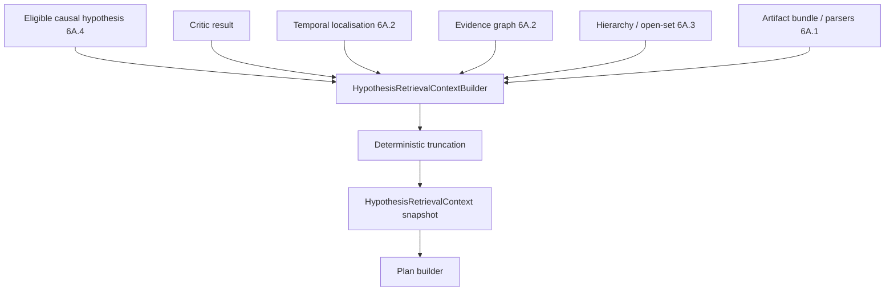

# Phase 6A.5 Part 1B — Retrieval Context

**Status:** Delivered  
**Context version:** `retrieval_context_v1` (Part 2 reuses v1 fields; no context schema bump)  
**Truncation rule:** `truncation_v1`

## Purpose

`HypothesisRetrievalContext` is a **bounded, hypothesis-scoped** assembly of already-persisted evidence used to plan and execute retrieval. The context builder **does not retrieve documents** — it only selects and truncates existing analysis artifacts.

## Construction flow

## Selection priority

1. Hypothesis-linked evidence  
2. Root and observed graph nodes  
3. Validated causal-path nodes/edges  
4. Primary temporal event  
5. Direct upstream / downstream temporal events  
6. Affected artifact  
7. Changed files connected to graph nodes  
8. Classification and open-set context  
9. Relevant parser evidence  
10. Historical placeholders for later retrieval  

## Required field groups

| Group | Examples |
|-------|----------|
| Identity | `analysis_id`, `organization_id`, `hypothesis_id`, `hypothesis_key` |
| Hypothesis | `causal_claim`, `category_code`, hierarchy codes, observations, missing evidence, prior score, status, critic |
| Temporal | primary summary/event id, upstream/downstream, confidence, warnings |
| Graph | root/observed nodes, path ids, neighborhood, consistency, warnings |
| Artifacts | affected path/id, related artifacts, parser evidence, availability |
| Security | `secret_redaction_status`, excluded fields, truncation indicators |
| Metadata | `context_version`, character counts, `was_truncated`, `truncated_sections` |

## Truncation

Never silent. Every truncated context records:

- `was_truncated`
- `original_size` / `final_size`
- `truncated_sections`
- `truncation_rule_version`
- `truncation_reasons`

Keep causal claim, category, root/observed nodes, strongest linked evidence, temporal primary, causal path, affected artifact, and missing-evidence markers first.

## Security

Do not put raw secrets, full Terraform state, credentials, or unrestricted logs into context. Query text derived from context is masked; secret-like queries are rejected by the plan builder.

## Non-claims

- Context is input to retrieval planning — not proof of causality.
- Missing temporal/graph/artifact data → partial context, not fabricated evidence.
- Part 1B context does **not** perform ranking or verification.
