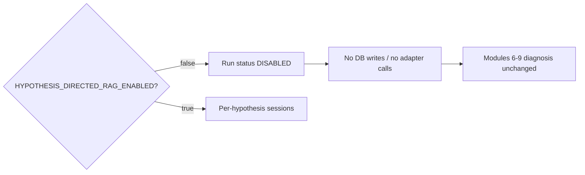
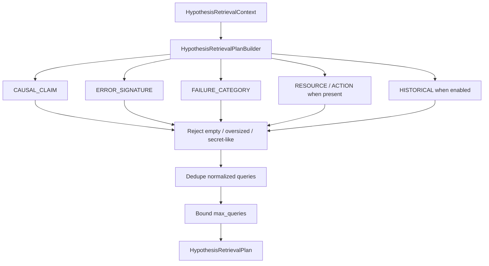
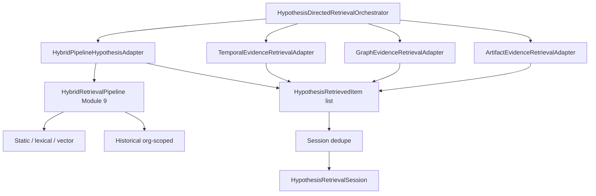
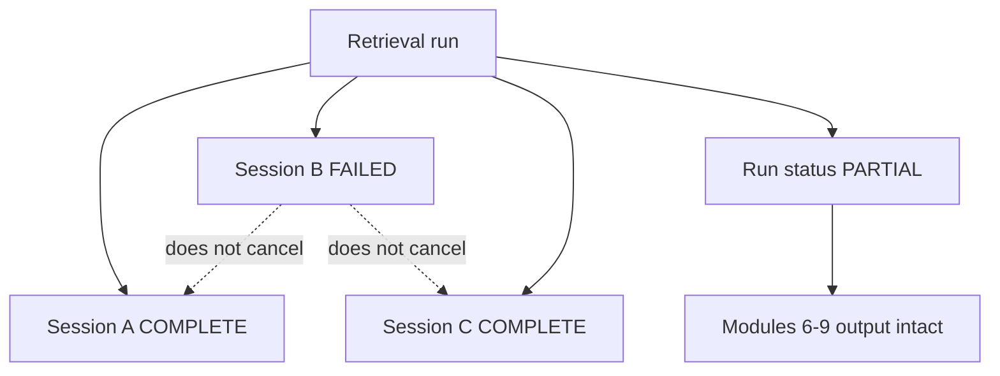

# Phase 6A.5 Part 1B — Retrieval Orchestrator

**Status:** Delivered  
**Pipeline version:** `hypothesis_directed_v1`  
**Plan version:** `retrieval_plan_v1`

## Purpose

`HypothesisDirectedRetrievalOrchestrator` runs **independent retrieval sessions** after Phase 6A.4. It plans queries, invokes adapters, deduplicates items, and optionally persists results. It does **not** rank hypotheses or prove support/contradiction.

## Insertion point

```text
AnalysisExecutionService.execute
  → AnalysisOrchestrator (Modules 6–9)
  → _maybe_persist_artifact_bundle / 6A.2
  → _maybe_run_phase6a3
  → _maybe_run_phase6a4
  → _maybe_run_phase6a5_hypothesis_retrieval   # soft-fail; flag OFF = no-op
  → _persist_results
```

## Flag-off fallback



## Plan construction



## Adapter architecture around HybridRetrievalPipeline



Unavailable adapters return explicit `SOURCE_UNAVAILABLE` — never simulated success. Hybrid adapter with `pipeline=None` is unavailable.

## Session failure isolation



- One failed session → continue others; persist partial package when persistence enabled.  
- Empty evidence → `NO_EVIDENCE` / insufficiency — **not** falsification.  
- Soft-fail at the execution-service hook — never block baseline diagnosis.

## Eligibility (summary)

| Eligible | Excluded |
|----------|----------|
| `READY_FOR_RANKING` | `CONTRADICTED`, `INVALID`, `DUPLICATE`, `REJECTED`, `FAILED`, `DISABLED` |
| Critic `ACCEPT_*` | Critic `CONTRADICTED` / `REJECT` |
| `INCOMPLETE` **with** `missing_evidence` | `INCOMPLETE` without missing evidence |

## Non-claims

- Part 1B = infrastructure, **not** causal ranking (`CAUSAL_RANKING_ENABLED` unused).  
- `SUPPORT_CANDIDATE` ≠ proven support; `CONTRADICTION_CANDIDATE` ≠ proven contradiction.  
- Retrieval failure does **not** disprove a hypothesis.  
- Evidence remains hypothesis-scoped after dedupe.
