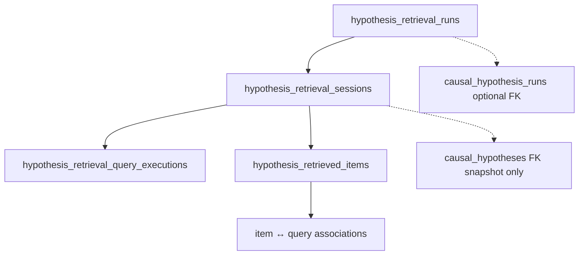
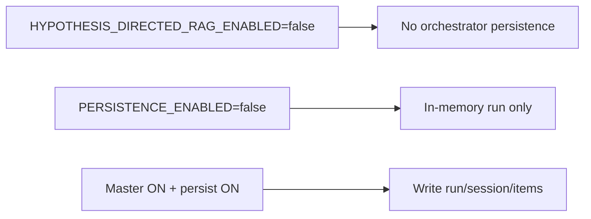

# Phase 6A.5 Part 1B — Retrieval Persistence

**Status:** Delivered  
**Migration:** `015_phase6a5_hyp_retrieval` (Part 2: **no** migration 016)  
**Flag:** `HYPOTHESIS_RETRIEVAL_PERSISTENCE_ENABLED` (default true; master RAG flag still OFF)

Part 2 intelligence payloads persist in existing JSONB: `plan_snapshot` (includes `adaptive_plan`), `session.metrics.intelligence`, and per-item `item_metadata` (`validation_status`, `retrieval_relevance_score`, `features`, …).

## Purpose

Additive, organization-scoped persistence of hypothesis-directed retrieval runs, sessions, query executions, and retrieved items. No historical backfill. Does not overwrite causal hypotheses or baseline `retrieved_documents`.

## Session persistence

## Tables (additive)

| Table | Role |
|-------|------|
| `hypothesis_retrieval_runs` | One run per analysis (unique org+analysis) |
| `hypothesis_retrieval_sessions` | One session per hypothesis per run |
| `hypothesis_retrieval_query_executions` | Per-query adapter outcomes |
| `hypothesis_retrieved_items` | Provenance-bearing evidence candidates |

Uniqueness: `(retrieval_run_id, hypothesis_id)` on sessions. Cascade delete from run/org as defined in migration ORM.

## Provenance on items

Items store source type/system/ids, document/chunk/artifact/graph/temporal/historical identifiers, scores, adapter name/version, embedding model version, relation **candidate**, redaction status, and associated query ids.

## Flag-off / disabled behaviour

## Failure isolation and soft-fail

- Persist after sessions complete; persist failure → warning + may mark run `PARTIAL`.  
- Failed session rows may still be written with errors/warnings.  
- Never mutate Modules 6–9 diagnosis rows from this path.

## Non-claims

- Persisted `SUPPORT_CANDIDATE` / `CONTRADICTION_CANDIDATE` are **candidates**, not proven relations.  
- Empty item set is recorded insufficiency — not disproof.  
- Evidence rows are **hypothesis-scoped**; identical KB chunks for two hypotheses remain separate session-linked rows.  
- Part 1B persistence does not store ranking outcomes.
