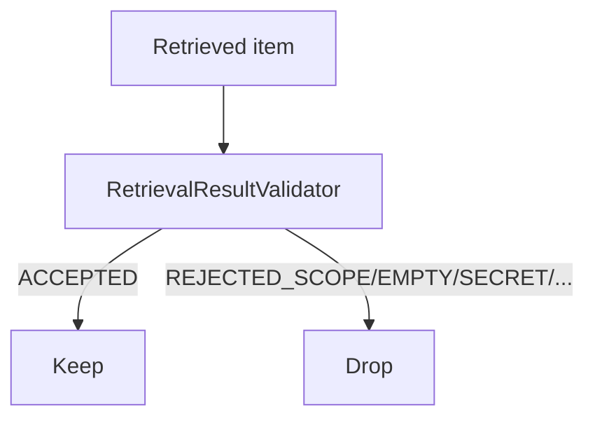

# Phase 6A.5 — Retrieval Validation

Version: `retrieval_result_validator_v1`

Validates org scope, emptiness, secrets, provenance, archived/untrusted history. Does **not** decide support or contradiction.
