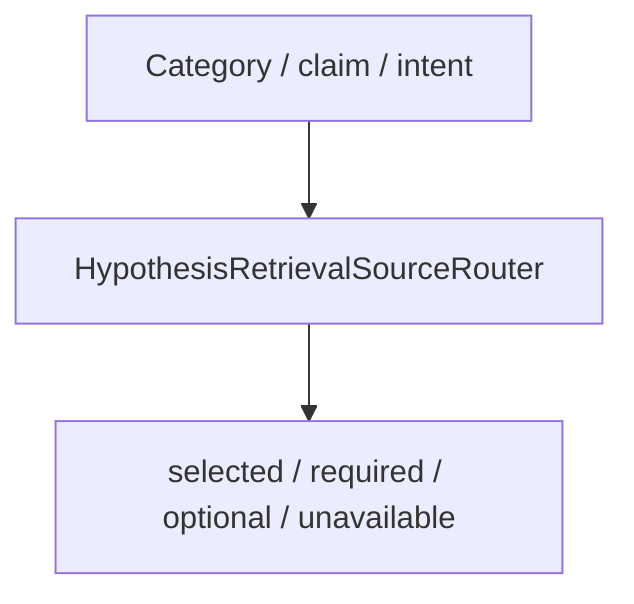

# Phase 6A.5 — Source Routing

Version: `hypothesis_source_router_v1`

Examples: IAM → ARTIFACT+GRAPH+STATIC/DOCS; Terraform → ARTIFACT+GRAPH+TEMPORAL; dependency → ARTIFACT+TEMPORAL+STATIC; unknown → lexical/vector + artifact.
