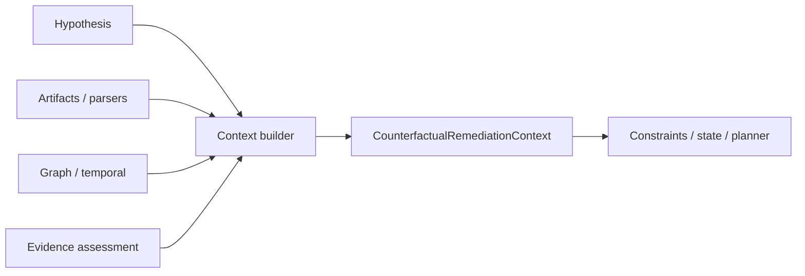

# Phase 6A.6 — Counterfactual Remediation Context

Bounded, masked planning context per hypothesis (`counterfactual_context_v1`).

## Contents (high level)

- Hypothesis identity, claim, ranking/selection snapshots
- Failure signature / observed failure nodes (when present)
- Graph path summaries (capped)
- Affected artifact metadata + parser entities
- Masked configuration fragments (secrets never as values)

## Flow

## Safety

- Untrusted artifact text is sanitized (`sanitize_untrusted_instructions`).
- Secrets masked via domain secret masker + extra patterns.
- Context truncated by `MAX_COUNTERFACTUAL_CONTEXT_CHARS`.
- Missing artifacts → incomplete context; never fabricate configuration.
