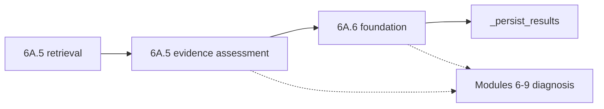
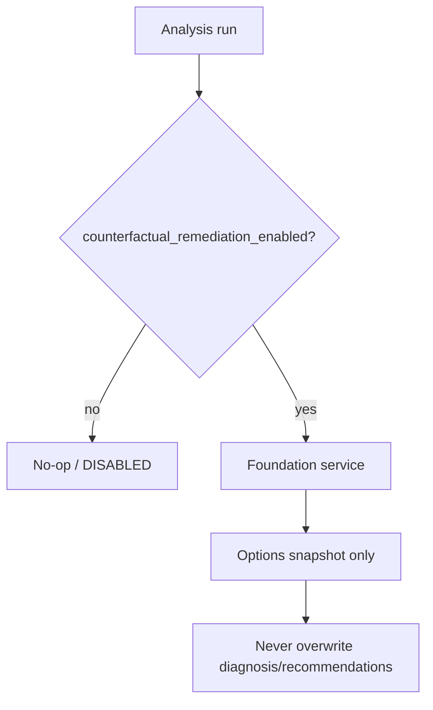

# Phase 6A.6 Part 1 — Counterfactual Remediation Foundation

**Status:** Part 1 foundation complete (flags OFF by default)  
**Not included:** Part 2 generation, verifier execution, apply path, frontend

## Scientific position

Hypothesis-conditional **candidate** remediation plans under deterministic constraints — not “an LLM generates a fix,” and not a verified repair.

Every candidate is:
- conditional on one causal hypothesis;
- **not verified**;
- **not applied**;
- produced without external tools or production credentials.

## Pipeline insertion

Soft-fail hook: `AnalysisExecutionService._maybe_run_phase6a6_counterfactual_foundation`  
after `_maybe_run_phase6a5_evidence_assessment`, before `_persist_results`.

## Flags (all OFF)

| Flag | Role |
|------|------|
| `COUNTERFACTUAL_REMEDIATION_ENABLED` | Master stage gate |
| `COUNTERFACTUAL_CONSTRAINT_EXTRACTION_ENABLED` | Extractors |
| `MINIMAL_CHANGE_PLANNING_ENABLED` | Planner skeletons |
| `COUNTERFACTUAL_TEMPLATE_REGISTRY_ENABLED` | Template resolve |
| `COUNTERFACTUAL_PERSISTENCE_ENABLED` | Migration 016 writes |
| `COUNTERFACTUAL_DEBUG_API_ENABLED` | Org-scoped GET APIs |

Request options cannot force these ON when server flags are OFF.

## Flags-off fallback

## Persistence

Additive migration `016_phase6a6_cf_foundation`. Separate from product `recommendations` tables.

## Debug APIs (GET only)

Under `/analyses/{analysis_run_id}/counterfactual-remediation-*` with `require_org_reader` + `X-Organization-Id`. No apply endpoint.

## Related docs

- `PHASE6A6_COUNTERFACTUAL_CONTEXT.md`
- `PHASE6A6_CURRENT_AND_COUNTERFACTUAL_STATE.md`
- `PHASE6A6_REMEDIATION_CONSTRAINTS.md`
- `PHASE6A6_MINIMAL_CHANGE_PLANNING.md`
- `PHASE6A6_REMEDIATION_TEMPLATE_REGISTRY.md`
- `PHASE6A6_COUNTERFACTUAL_REMEDIATION_AUDIT.md`
