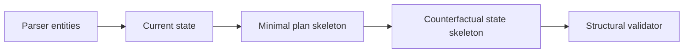

# Phase 6A.6 — Current vs Counterfactual State

## Separation

| Snapshot | Meaning |
|----------|---------|
| Current state | Observed / parsed pre-change configuration (bounded) |
| Counterfactual state | Expected post-change skeleton (hypothetical) |

Neither is runtime-verified. Part 1 does not execute Terraform/AWS/kubectl.

## Current state fields (examples)

Artifact id/type/path, content hash, structured entities, current values/permissions/region, missing fields, redaction status.

## Counterfactual state (Part 1)

Expected failure-condition status, proposed values (skeleton), assumptions, unknown effects. Full patch bodies are out of scope.
