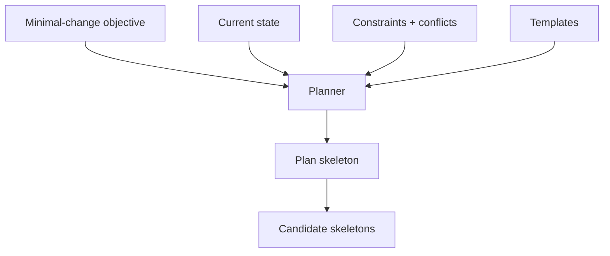

# Phase 6A.6 — Minimal Change Planning

Planner: `DeterministicMinimalChangePlanner` (`minimal_change_planner_v1`).

Part 1 returns **skeletons only** — no final patch bodies.

## Locality rules (examples)

- Prefer one file / exact property replacement
- Prefer update wrong role reference over broadening permissions
- Prefer scoped IAM over wildcards
- Never fix tests by deletion/bypass
- Never fix policy failure by disabling scanners

Statuses include `READY_FOR_GENERATION`, `INCOMPLETE`, `BLOCKED_BY_CONSTRAINTS`, `UNSUPPORTED_ARTIFACT`.
