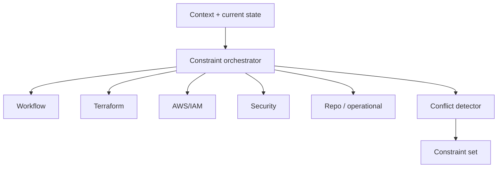

# Phase 6A.6 — Remediation Constraints

Deterministic constraint extraction (`remediation_constraints_v1` / `constraint_extractor_v1`).

## Orchestration

## Properties

- Blocking vs informational severities
- Machine-readable rules (no LLM resolution of conflicts)
- Completeness may be `INSUFFICIENT` when sources missing
- Constraint completeness ≠ evidence sufficiency

Specialist docs: workflow, Terraform, AWS/IAM, security.
