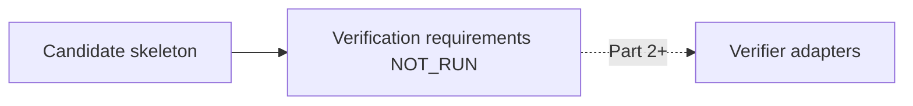

# Phase 6A.6 — Remediation Template Registry

Registry: `RemediationTemplateRegistry` + `build_initial_template_skeletons` (`remediation_templates_v1`).

## Role

Map failure families → change-type skeletons (IAM scoped allow, UPDATE_ROLE, workflow secret ref, Terraform reference fix, dependency align, …).

Builders are marked **unimplemented** in Part 1 (`candidate_builder_implemented=false`).

## Structural validation

`CounterfactualCandidateStructuralValidator` rejects wildcards, secret material, org/scope mismatches, oversized patches — **structural only**, not independent verification.

## Future verifier handoff

Part 1 records reserved verifier types only; nothing executes.
