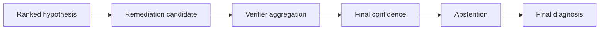

# Phase 6A.7 — Final Diagnosis (Submission MVP)

**Status:** Complete (feature flags OFF by default)  
**Persistence:** `analysis_runs.output_summary["final_diagnosis"]` JSONB (no new migration)  
**Baseline:** after Phase 6A.6 Part 3 (`018_phase6a6_verifiers`)

## Purpose

Close the research pipeline with a **final decision layer**:

verifier aggregation → confidence → abstention → final diagnosis → explanation

## Non-goals

- Applied remediation / repo mutation / cloud apply
- Causal UI
- Trained calibrators / fine-tuning
- Treating highest-ranked hypothesis as proven root cause

## Core principle

| Concept | Meaning |
|---------|---------|
| Highest-ranked hypothesis | Ranking candidate only |
| Verified remediation | Temporary-workspace checks passed |
| Final diagnosis | Evidence-based decision when thresholds met |
| Abstention | Intentional safe behavior |

## Flags (all default false)

- `FINAL_DIAGNOSIS_ENABLED`
- `FINAL_CONFIDENCE_ENABLED`
- `DIAGNOSIS_ABSTENTION_ENABLED`
- `FINAL_EXPLANATION_ENABLED`
- `FINAL_DIAGNOSIS_DEBUG_API_ENABLED`

Thresholds: `MIN_FINAL_DIAGNOSIS_SCORE`, `MIN_FINAL_EVIDENCE_SUFFICIENCY`, `MIN_FINAL_VERIFIER_SUPPORT`, `MAX_FINAL_CONTRADICTION_PENALTY`, `MIN_TOP_HYPOTHESIS_MARGIN`, `MAX_FINAL_EXPLANATION_ITEMS`.

## Flow

## Statuses

`DIAGNOSED` · `DIAGNOSED_WITH_WARNINGS` · `INSUFFICIENT_EVIDENCE` · `CONFLICTED` · `UNKNOWN` · `FAILED` · `DISABLED`

## APIs (org-scoped read only)

- `GET /api/v1/analyses/{id}/final-diagnosis`
- `GET /api/v1/analyses/{id}/final-confidence`
- `GET /api/v1/analyses/{id}/abstention-decision`
- `GET /api/v1/analyses/{id}/final-explanation`
- `GET /api/v1/analyses/{id}/final-verifier-summary`

## Package

- `app/domain/final_diagnosis/`
- `app/ai/final_diagnosis/`
- `app/application/services/phase6a7_service.py`
- `app/schemas/phase6a7.py`

See also: `PHASE6A7_FINAL_CONFIDENCE.md`, `PHASE6A7_ABSTENTION.md`, `PHASE6A7_FINAL_EXPLANATION.md`, `PHASE6A7_SUBMISSION_MVP.md`.
