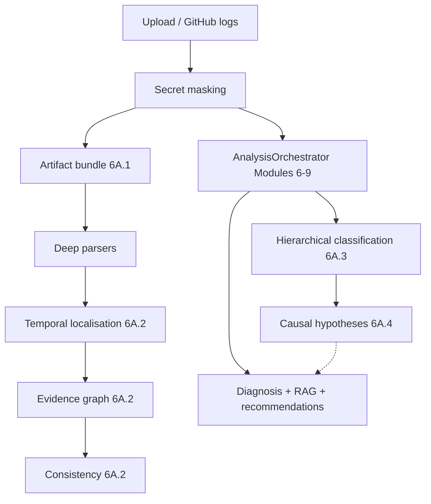

# Phase 6A — Causal AI Pipeline (overview)

Phase 6A extends the existing analysis spine with artifact acquisition, deep parsers, temporal localisation, and an evidence graph — **without** replacing Modules 6–9 diagnosis.

## Subphases

| Phase | Status | Deliverable |
|-------|--------|-------------|
| 6A.0 | Done | Architecture audit |
| 6A.1 | Done | Artifact bundle + parsers + GitHub acquisition |
| 6A.2 | Done | Temporal localisation + evidence graph + consistency |
| 6A.3 | Done | Hierarchical classification + open-set + disagreement |
| 6A.4 | Done | Competing causal hypothesis generation (candidates only) |
| 6A.5+ | Not started | Hypothesis-directed RAG, ranking, remediations, verifiers, Causal UI |

## Pipeline (flags OFF = unchanged production path)

6A.2–6A.4 stages soft-fail. Hypotheses are **competing candidates**, not verified causes.

## Important

- Temporal / graph relationships support later causal reasoning.
- Heuristic precedence is **not** confirmed causality.
- Missing artifacts → partial graph, never fabricated evidence.
- Open-set may return UNKNOWN; disagreement is an uncertainty signal only.
- Hypothesis `generation_prior_score` is not final ranking or verification.
