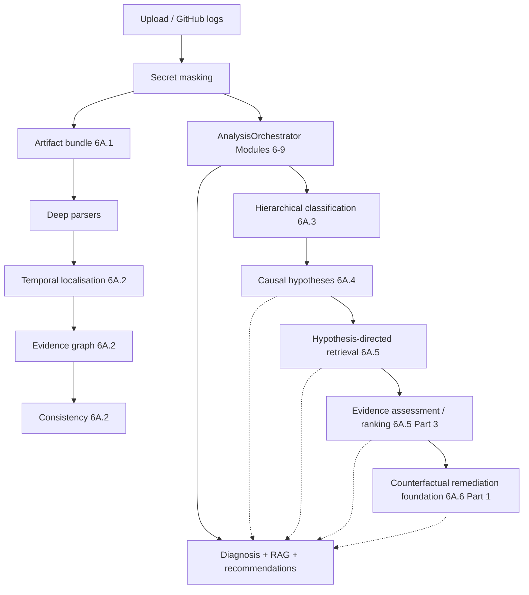

# Phase 6A — Causal AI Pipeline (overview)

Phase 6A extends the existing analysis spine with artifact acquisition, deep parsers, temporal localisation, and an evidence graph — **without** replacing Modules 6–9 diagnosis.

## Subphases

| Phase | Status | Deliverable |
|-------|--------|-------------|
| 6A.0 | Done | Architecture audit |
| 6A.1 | Done | Artifact bundle + parsers + GitHub acquisition |
| 6A.2 | Done | Temporal localisation + evidence graph + consistency |
| 6A.3 | Done | Hierarchical classification + open-set + disagreement |
| 6A.4 | Done | Competing causal hypothesis generation (candidates only) |
| 6A.5 Part 1A | Done | Retrieval architecture audit |
| 6A.5 Part 1B | Done | Hypothesis-directed retrieval infrastructure (flags OFF; no ranking) |
| 6A.5 Part 2 | Done | Adaptive retrieval intelligence (flags OFF; no migration 016) |
| 6A.5 Part 3 | Done | Evidence assessment / ranking / candidate selection (flags OFF; candidates only; no migration 016) |
| 6A.6 Part 1 | Done | Counterfactual remediation foundation (flags OFF; migration 016; no verifiers/apply) |
| 6A.6 Part 2+ / 6A.7–6A.9 | Not started | Generation, verifiers, Causal UI |

## Pipeline (flags OFF = unchanged production path)

6A.2–6A.6 Part 1 stages soft-fail. Hypotheses are **competing candidates**, not verified causes. Part 1B retrieval items are evidence **candidates** only (`SUPPORT_CANDIDATE` ≠ proven support). Part 3 `RankingScore` ≠ root-cause confidence; selected candidates ≠ final diagnosis. Phase 6A.6 Part 1 candidates are hypothesis-conditional, unverified, and never applied.

## Important

- Temporal / graph relationships support later causal reasoning.
- Heuristic precedence is **not** confirmed causality.
- Missing artifacts → partial graph, never fabricated evidence.
- Open-set may return UNKNOWN; disagreement is an uncertainty signal only.
- Hypothesis `generation_prior_score` is not final ranking or verification.
- Phase 6A.5 Part 1B retrieval is hypothesis-scoped infrastructure; empty retrieval does not disprove a hypothesis.
- Phase 6A.5 Part 2 adds adaptive intents/routing/validation/relevance/follow-up behind OFF-by-default flags; `retrieval_relevance_score` is not causal support; no migration 016.
- Phase 6A.5 Part 3 assesses sufficiency/support/contradiction candidates and ranks hypotheses behind OFF-by-default flags; no migration 016; no PROVEN/VERIFIED language.
- Phase 6A.6 Part 1 adds counterfactual remediation foundation behind OFF-by-default flags; migration `016_phase6a6_cf_foundation`; no verifier execution and no apply path. See `docs/PHASE6A6_COUNTERFACTUAL_REMEDIATION_FOUNDATION.md`.
