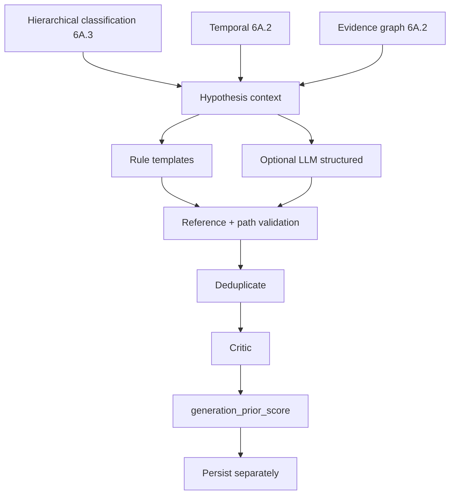
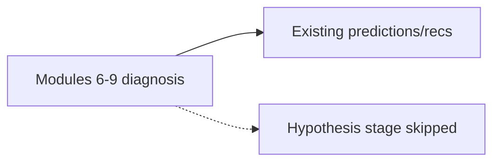

# Phase 6A — Competing Causal Hypotheses

**Phase:** 6A.4  
**Status:** Implemented (flags default OFF)

## Purpose

Generate **multiple competing** causal hypotheses for a suitable incident.

This phase produces **candidates only**. It does **not** verify, rank finally, remediate, or execute verifiers.

When flags are OFF:

## Feature flags

| Flag | Default |
|------|---------|
| `CAUSAL_HYPOTHESIS_GENERATION_ENABLED` | false |
| `RULE_HYPOTHESIS_GENERATION_ENABLED` | false |
| `LLM_HYPOTHESIS_GENERATION_ENABLED` | false |
| `HYPOTHESIS_CRITIC_ENABLED` | false |

## Explicit non-claims

- Hypotheses are competing explanations, not verified root causes.
- `generation_prior_score` is **not** final causal ranking.
- Supporting evidence does not alone prove causality.
- No `VERIFIED` status in this phase.
