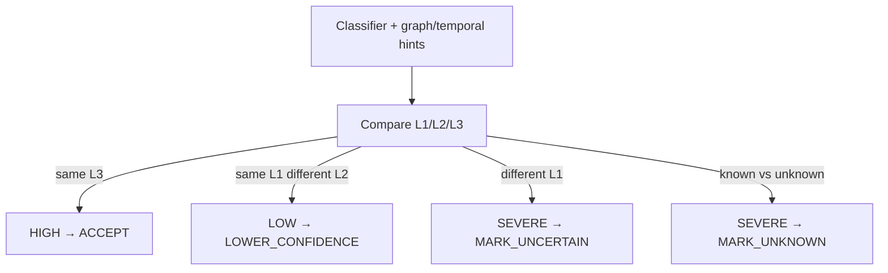

# Phase 6A — Classification Disagreement

**Phase:** 6A.3  
**Status:** Implemented (flag default OFF)

## Purpose

Measure disagreement among:

- rule classifier
- keyword/learned stage
- structured LLM classification (validated codes only)
- optional temporal / graph category hints

Disagreement is an **uncertainty signal**. Severe disagreement is **never** resolved by majority voting.

## Agreement levels

`HIGH` | `MODERATE` | `LOW` | `SEVERE` | `NOT_APPLICABLE`

## Conflict types

- `SAME_DOMAIN_DIFFERENT_SUBCATEGORY`
- `DIFFERENT_DOMAIN`
- `RULE_VS_MODEL`
- `LOG_VS_GRAPH`
- `TEMPORAL_VS_SEMANTIC`
- `KNOWN_VS_UNKNOWN`
- `INSUFFICIENT_EVIDENCE`

## Recommended actions

`ACCEPT`, `LOWER_CONFIDENCE`, `REQUEST_MORE_EVIDENCE`, `TRIGGER_TARGETED_RETRIEVAL_LATER`, `MARK_UNCERTAIN`, `MARK_UNKNOWN`

Hypothesis-directed retrieval belongs to a later phase.
