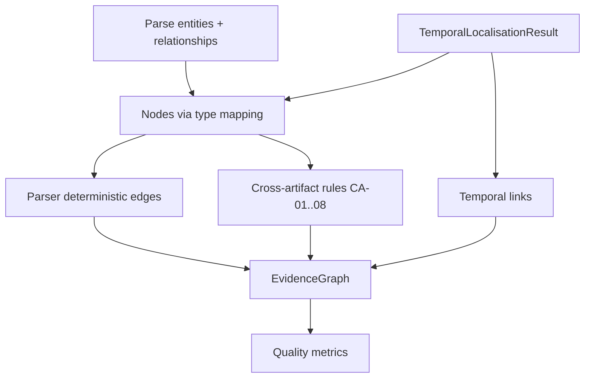

# Phase 6A.2 — Cross-Artifact Evidence Graph

**Status:** Implemented  
**Builder version:** `evidence_graph_v1`  
**Flag:** `EVIDENCE_GRAPH_ENABLED=false` (default)

## Purpose

Construct a typed `EvidenceGraph` from parser entities/relationships, temporal localisation links, and explicit cross-artifact rules.

Creates **structural and temporal evidence** for later causal reasoning. Does **not** generate competing hypotheses or remediations.

## Construction

## Derivation types

| Type | Meaning |
|------|---------|
| `PARSER_DETERMINISTIC` | From parser relationships |
| `WORKFLOW_STRUCTURE` | Workflow contains/needs/uses |
| `TERRAFORM_REFERENCE` | TF depends_on / references |
| `TEMPORAL_DETERMINISTIC` | Timestamp-ordered |
| `TEMPORAL_HEURISTIC` | Heuristic precedence (**not proven causality**) |
| `CROSS_ARTIFACT_RULE` | Explicit CA-* rules |
| `LLM_INFERRED` | Reserved — unused in 6A.2 |

## Limits

`EVIDENCE_GRAPH_MAX_NODES` (2000), `EVIDENCE_GRAPH_MAX_EDGES` (5000). Truncation is explicit (`status=TRUNCATED`).

## API

- `GET /api/v1/analyses/{id}/evidence-graph`
- `GET /api/v1/analyses/{id}/evidence-graph/nodes`
- `GET /api/v1/analyses/{id}/evidence-graph/edges`

Raw secret values are never stored in node metadata (redacted keys).
