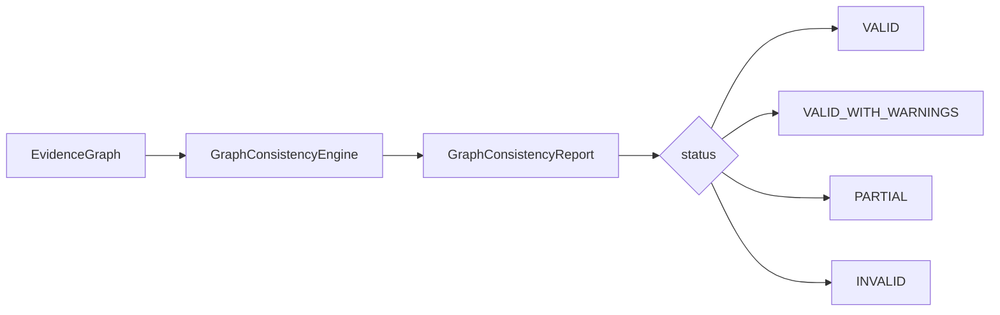

# Phase 6A.2 — Graph Consistency Validation

**Status:** Implemented  
**Rules version:** `graph_consistency_v1`  
**Flag:** `GRAPH_CONSISTENCY_ENABLED=false` (default)

## Purpose

Validate that evidence-graph links are supported by available artifacts and do not violate org scoping, temporal direction, or Terraform/IAM provenance rules.

## Checks

| ID | Check |
|----|-------|
| GC-01 | Step must not reference a Terraform output when none were parsed |
| GC-02 | Policy–error association should match a principal in evidence |
| GC-03 | AWS resource ARNs should be parseable when labelled as ARNs |
| GC-04 | Changed files should link to a commit when commit nodes exist |
| GC-05 | Downstream symptom edges must not point temporally backward |
| GC-06 | `DEPENDS_ON` must use parser/TF derivation |
| GC-07 | All nodes/edges must match organization ownership |
| GC-08 | Unusual node-type pairs for cross-artifact edges → warning |

## API

`GET /api/v1/analyses/{id}/graph-consistency`
