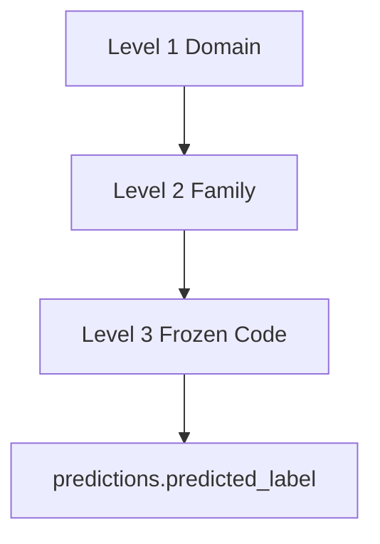
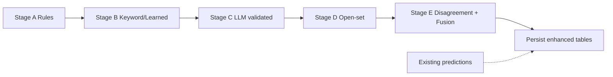
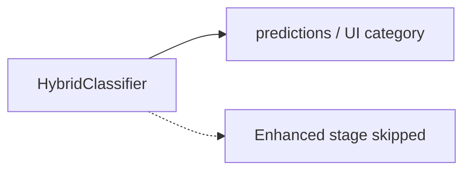

# Phase 6A — Hierarchical Failure Classification

**Phase:** 6A.3  
**Status:** Implemented (flags default OFF)

## Purpose

Extend the existing hybrid classifier so DevGuard AI can answer:

- What broad failure family is this? (Level 1)
- What subcategory is most likely? (Level 2)
- What specific known failure type is supported? (Level 3 = frozen code)
- Do classifiers disagree?
- What evidence is still missing?

This phase **does not** generate causal hypotheses, remediations, or verifier execution.

## Frozen taxonomy constraint

Existing `failure_categories.code` values are **frozen**. The hierarchy wraps them:

Example:

`SECURITY` → `IAM_POLICY` → `aws_permission_failure`

## Multi-stage flow

When `HIERARCHICAL_CLASSIFICATION_ENABLED=false`:

## Feature flags

| Flag | Default |
|------|---------|
| `HIERARCHICAL_CLASSIFICATION_ENABLED` | false |
| `OPEN_SET_DETECTION_ENABLED` | false |
| `CLASSIFICATION_DISAGREEMENT_ENABLED` | false |
| `CLASSIFICATION_CONFIDENCE_BREAKDOWN_ENABLED` | false |

## APIs

- `GET /api/v1/analyses/{id}/hierarchical-classification`
- `GET /api/v1/analyses/{id}/classification-candidates`
- `GET /api/v1/analyses/{id}/open-set-assessment`
- `GET /api/v1/analyses/{id}/classification-disagreement`
- `GET /api/v1/analyses/{id}/classification-confidence`
- `GET /api/v1/failure-taxonomy`

## Persistence

Migration `013_phase6a3_hier_class` (additive only; no historical backfill).

## Explicit non-claims

- Hierarchy does not change frozen category codes.
- Enhanced classification is optional.
- This is **not** causal diagnosis.
