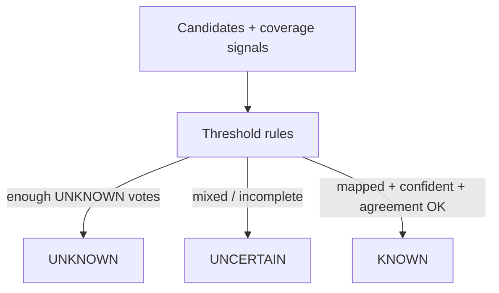

# Phase 6A — Open-Set Failure Detection

**Phase:** 6A.3  
**Status:** Implemented (threshold-based; flag default OFF)

## Purpose

Answer: *Does this incident sufficiently match any known frozen failure category?*

The detector may return **KNOWN**, **UNCERTAIN**, or **UNKNOWN**. It must not force every failure into a known class.

## Method

Transparent threshold rules (`open_set_rules_v1`). This is **not** claimed as a novel statistical open-set method.

## Configuration

| Setting | Default |
|---------|---------|
| `OPEN_SET_DETECTION_ENABLED` | false |
| `OPEN_SET_DEFAULT_CONFIDENCE_THRESHOLD` | 0.55 |
| `OPEN_SET_DEFAULT_MARGIN_THRESHOLD` | 0.08 |
| `OPEN_SET_DEFAULT_DISTANCE_THRESHOLD` | 0.65 |
| `OPEN_SET_MIN_EVIDENCE_COVERAGE` | 0.25 |
| `OPEN_SET_CATEGORY_THRESHOLDS_JSON` | `{}` |

Malformed JSON fails startup validation.

## Example triggered conditions

- no deterministic rule match
- confidence below threshold
- top-two margin too small
- representation distance high
- evidence coverage low
- invalid / unknown category
- severe disagreement
- novel tool signature

Security categories apply stricter evidence expectations before **KNOWN**.
