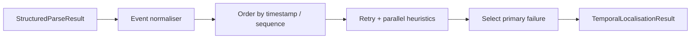

# Phase 6A.2 — Temporal Root-Cause Localisation

**Status:** Implemented  
**Heuristics version:** `temporal_heuristics_v1`  
**Flag:** `TEMPORAL_LOCALISATION_ENABLED=false` (default)

## Purpose

Normalise parser entities into ordered `TemporalEvent`s and identify the **earliest meaningful failure**, distinguishing initiating errors from downstream workflow/job/exit symptoms.

This does **not** prove causality. Heuristic precedence links are explicitly marked `proven_causality=false`.

## Flow

## Ordering

1. Prefer precise timestamps within a job.
2. Fall back to parser sequence when timestamps are absent.
3. Do not impose a false total order across unrelated parallel jobs (`PARALLEL_WITH`).
4. Record `timestamp_quality`: PRECISE | COARSE | ABSENT | CONFLICTING.

## Primary-failure heuristics

- Prefer auth / permission / Terraform diagnostic / dependency / resource failures over generic exit-code / job-failed / workflow-failed.
- Treat later generic failures as `DOWNSTREAM_SYMPTOM_OF` the primary event.
- Retry success: suppress earlier transient errors in the same step.
- Retry repeated failure: keep earliest repeated high-priority error.
- Confidence decreases when timestamps are missing, step mapping is incomplete, or multiple equally early errors exist.

## Statuses

`COMPLETE` | `PARTIAL` | `INCONCLUSIVE` | `FAILED` | `DISABLED`

## Persistence

Tables: `temporal_localisation_results`, `temporal_events`, `temporal_event_links` (migration `012`).

## API

- `GET /api/v1/analyses/{id}/temporal-localisation`
- `GET /api/v1/analyses/{id}/temporal-events`
