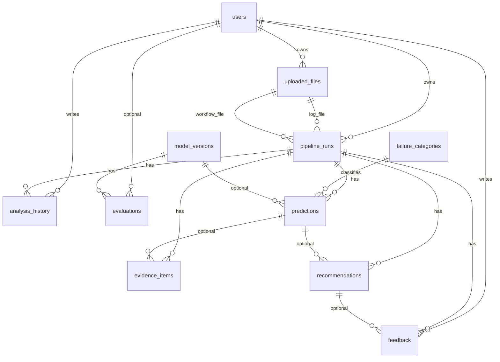
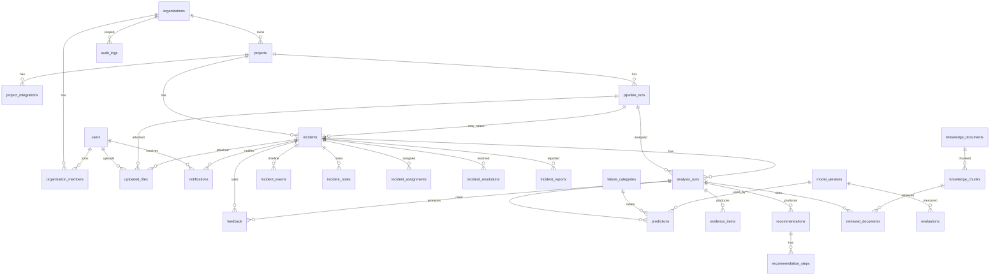
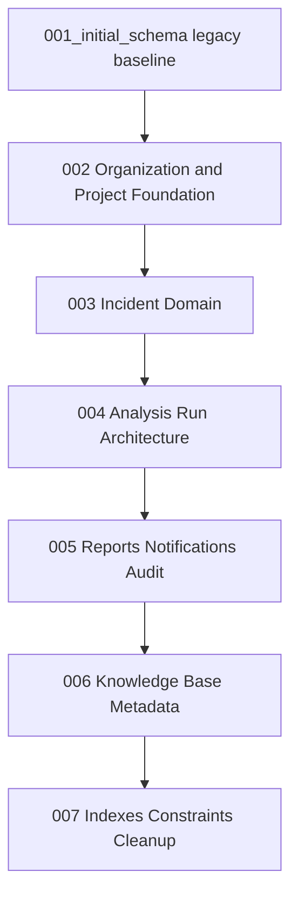

# Schema Evolution Plan

**Project:** DevGuard AI  
**Document:** `docs/SCHEMA_EVOLUTION_PLAN.md`  
**Status:** Accepted — approved by project owner, 24 July 2026  
**Related:** ADR-012 (`docs/ARCHITECTURE_DECISION_LOG.md`) — Accepted  
**Authority:** MASTER_ARCHITECTURE.md → DATABASE_ARCHITECTURE.md  

**Post-acceptance scope (schema only):**

- Alembic Migrations 002–007, SQLAlchemy models, seeds, and schema tests may proceed  
- Do **not** implement auth APIs, business APIs, AI, or frontend features until separately approved  
- Local development database recreation is allowed only under **Option B** after migrations are authored and validated  

---

## 1. Purpose

Define a safe path from the **legacy flat ML schema** (Alembic `001_initial_schema`, 11 tables) to the **frozen incident-centred, organization-ready** schema in DATABASE_ARCHITECTURE.md — without discarding the Module 1 foundation.

---

## 2. Baseline

| Item | Value |
|------|-------|
| Current Alembic head | `001_initial_schema` |
| Application tables | 11 (+ `alembic_version`) |
| Domain shape | User → UploadedFile / PipelineRun → Prediction / Evidence / Recommendation |
| Target domain shape | Organization → Project → PipelineRun → Incident → AnalysisRun → artefacts |

### Current schema relationship summary

### Target schema relationship summary

---

## 3. Legacy Table Inventory and Evolution Mapping

For each existing table: current purpose, columns, target disposition, and migration notes.

---

### 3.1 `users`

| Field | Detail |
|-------|--------|
| **Current table** | `users` |
| **Current purpose** | Platform accounts (pre-auth implementation) |
| **Current columns** | `id`, `email` (UQ), `hashed_password`, `full_name`, `role` (`admin\|analyst\|viewer`), `is_active`, `created_at`, `updated_at` |
| **Target table** | `users` (evolve) + `organization_members` (new) |
| **Disposition** | **Evolve** |
| **Retain** | `id`, `email`, `full_name`, `is_active`, `created_at`, `updated_at` |
| **Rename** | `hashed_password` → `password_hash` |
| **Add** | `avatar_url` (NULL), `last_login_at` (NULL); `is_platform_admin` (BOOLEAN, DEFAULT false) for platform-level admin; remove/ignore legacy global `role` values that duplicate org membership |
| **Relationships to add** | Membership via `organization_members`; creator FKs from projects/incidents later |
| **Indexes / constraints** | Keep unique email; index email; consider lower(email) uniqueness policy |
| **Data migration** | Rename column; map legacy `analyst` → `engineer` on membership where needed; **no `analyst` role** in target model; seed default org owner via idempotent seed script + env vars |
| **Risk** | **Medium** — enum/role rename; password column rename breaks ORM until models updated |

---

### 3.2 `uploaded_files`

| Field | Detail |
|-------|--------|
| **Current table** | `uploaded_files` |
| **Current purpose** | File metadata for logs/workflows |
| **Current columns** | `id`, `user_id`, `filename`, `stored_path`, `file_type`, `mime_type`, `size_bytes`, `checksum_sha256`, `platform`, `is_processed`, `created_at` |
| **Target table** | `uploaded_files` (evolve) |
| **Disposition** | **Evolve** |
| **Retain** | `id`, `user_id`, `mime_type`, `size_bytes`, `checksum_sha256`, `created_at` (as `uploaded_at` or keep + add) |
| **Rename** | `filename` → `original_filename` (or add sibling columns); `stored_path` → `storage_path` |
| **Add** | `project_id`, `pipeline_run_id`, `incident_id`, `stored_filename`, validation/secret/processing status fields, `extracted_metadata` JSONB |
| **Remove / replace** | `platform` (prefer project/pipeline provider); `is_processed` → status machine columns |
| **Relationships to add** | FK → `projects`, `pipeline_runs`, `incidents` (nullable as lifecycle requires) |
| **Indexes / constraints** | Keep size check; add indexes on `(project_id)`, `(incident_id)`, `(pipeline_run_id)` |
| **Data migration** | Existing rows need default project/incident after those tables exist (backfill or leave NULL until product data exists) |
| **Risk** | **High** — FK ordering vs pipeline_runs circularity; status redesign |

---

### 3.3 `pipeline_runs`

| Field | Detail |
|-------|--------|
| **Current table** | `pipeline_runs` |
| **Current purpose** | Analysis/run container owned by user + file FKs |
| **Current columns** | `id`, `user_id`, `uploaded_file_id`, `workflow_file_id`, `status` (`pending\|processing\|completed\|failed`), `platform`, `pipeline_name`, `job_name`, `started_at`, `finished_at`, `raw_log_excerpt`, `metadata` (Python `run_metadata`), `created_at` |
| **Target table** | `pipeline_runs` (evolve) |
| **Disposition** | **Evolve** |
| **Retain** | `id`, `started_at`, `created_at`; map `finished_at` → `completed_at`; keep useful name fields |
| **Rename** | `finished_at` → `completed_at`; `metadata`/`run_metadata` → `raw_metadata`; `platform` → `provider` |
| **Add** | `project_id` (NOT NULL after backfill), `external_run_id`, `branch`, `commit_sha`, `triggered_by`, `environment`, `duration_seconds`, `source_url` |
| **Remove / replace** | Primary ownership `user_id` → `project_id`; file FKs may move to `uploaded_files` pointing at run rather than run pointing at files |
| **Status enum** | Map to `queued\|running\|succeeded\|failed\|cancelled` |
| **Relationships to add** | FK → `projects`; incidents reference runs |
| **Indexes** | `(project_id, created_at DESC)`, `(project_id, status)`, `(provider, external_run_id)` |
| **Data migration** | Assign every legacy run to a default project; remap statuses |
| **Risk** | **High** — ownership model change; enum change; file relationship inversion |

---

### 3.4 `failure_categories`

| Field | Detail |
|-------|--------|
| **Current table** | `failure_categories` |
| **Current purpose** | Seeded taxonomy (11 MSc categories) |
| **Current columns** | `id`, `name` (UQ), `slug` (UQ), `description`, `is_active`, `created_at` |
| **Target table** | `failure_categories` (evolve) |
| **Disposition** | **Evolve** |
| **Retain** | `id`, `name`, `description`, `is_active`, `created_at` |
| **Rename** | `slug` → `code` (or dual-write then drop `slug`) |
| **Add** | `parent_id` (NULL), `default_severity` (NULL) |
| **Relationships** | Self-FK optional hierarchy; predictions reference category |
| **Indexes / constraints** | Unique `code`; index `code` |
| **Data migration** | Copy `slug` → `code`; **keep the 11 seeded failure categories for v1.0** (accepted) |
| **Risk** | **Medium** — seed + repository `get_by_slug` must become `get_by_code` |

---

### 3.5 `predictions`

| Field | Detail |
|-------|--------|
| **Current table** | `predictions` |
| **Current purpose** | Classifier output linked to pipeline run |
| **Current columns** | `id`, `pipeline_run_id`, `category_id`, `model_version_id`, `confidence_score`, `classifier_name`, `feature_vector_hash`, `probabilities` JSONB, `created_at` |
| **Target table** | `predictions` (evolve) |
| **Disposition** | **Evolve** |
| **Retain** | `id`, `model_version_id`, `created_at`; confidence concept |
| **Rename** | `category_id` → `failure_category_id`; `confidence_score` → `confidence` |
| **Add** | `analysis_run_id` (NOT NULL after backfill), `rank`, `predicted_label`, root-cause/explanation text fields, `reasoning_metadata` |
| **Remove / replace** | Primary parent `pipeline_run_id` → `analysis_run_id` (pipeline linkage via analysis_run) |
| **Relationships** | FK → `analysis_runs`, `failure_categories`, `model_versions` |
| **Constraints** | UNIQUE(`analysis_run_id`, `rank`); confidence 0–1 |
| **Data migration** | For each legacy prediction, create/find analysis_run then relink (only if legacy data kept) |
| **Risk** | **High** — parent rewrite |

---

### 3.6 `evidence_items`

| Field | Detail |
|-------|--------|
| **Current table** | `evidence_items` |
| **Current purpose** | Evidence excerpts for a run/prediction |
| **Current columns** | `id`, `pipeline_run_id`, `prediction_id`, `evidence_type`, `content`, `source_location`, `relevance_score`, `highlight_start`, `highlight_end`, `created_at` |
| **Target table** | `evidence_items` (evolve) |
| **Disposition** | **Evolve** |
| **Retain** | `id`, `prediction_id`, `evidence_type`, `created_at`; content → `raw_excerpt` / `normalized_excerpt` |
| **Rename** | `content` → split raw/normalized; `relevance_score` → `importance_score`; highlights → `line_start`/`line_end` |
| **Add** | `analysis_run_id`, `uploaded_file_id`, `source_name`, `explanation`, `metadata` JSONB |
| **Remove** | Primary `pipeline_run_id` after analysis_run link exists |
| **Risk** | **High** |

---

### 3.7 `recommendations`

| Field | Detail |
|-------|--------|
| **Current table** | `recommendations` |
| **Current purpose** | Single LLM-style recommendation blob per run |
| **Current columns** | `id`, `pipeline_run_id`, `prediction_id`, `root_cause`, `explanation`, `remediation_steps` JSONB, `risk_level`, `confidence_score`, `preventive_actions` JSONB, `future_improvements` JSONB, `llm_model`, `rag_sources` JSONB, `created_at` |
| **Target table** | `recommendations` (parent/summary) + `recommendation_steps` (normalized steps) |
| **Disposition** | **Evolve** parent summary; **create** `recommendation_steps` in Migration 004 |
| **Retain / reshape parent** | `id`, `prediction_id`, `analysis_run_id`, optional summary fields (`root_cause`, `explanation`), `llm_model`, `confidence`, timestamps — **not** the primary step model |
| **Child table** | `recommendation_steps`: `step_number`, `step_type` (`remediation` \| `verification` \| `prevention`), title/action/explanation/expected_result, risk/difficulty/command_template, accepted/completed |
| **Remove / reshape** | Legacy JSON remediation blobs (`remediation_steps`, `preventive_actions`, `future_improvements`) are **not** the source of truth; expand into `recommendation_steps` rows then drop JSON columns in cleanup |
| **Constraints** | UNIQUE(`recommendation_id`, `step_number`) on steps |
| **Data migration** | Expand JSON into `recommendation_steps` if preserving data (Option A); under Option B re-seed empty |
| **Risk** | **High** — shape change |

---

### 3.8 `model_versions`

| Field | Detail |
|-------|--------|
| **Current table** | `model_versions` |
| **Current purpose** | Classifier artefact registry |
| **Current columns** | `id`, `name`, `version`, `classifier_type`, `artifact_path`, `metrics` JSONB, `training_dataset_ref`, `is_active`, `trained_at`, `created_at` |
| **Target table** | `model_versions` (evolve) |
| **Disposition** | **Evolve** |
| **Retain** | `id`, `version`, `artifact_path`, `metrics`, `trained_at`, uniqueness `(name, version)` |
| **Rename** | `name` → `model_name`; `classifier_type` → `model_type`; `training_dataset_ref` → `training_dataset_version` |
| **Add** | `provider`, `configuration` JSONB, `status` |
| **Risk** | **Low–Medium** |

---

### 3.9 `evaluations`

| Field | Detail |
|-------|--------|
| **Current table** | `evaluations` |
| **Current purpose** | Model evaluation snapshots |
| **Current columns** | `id`, `model_version_id`, `user_id`, `dataset_name`, `metrics` JSONB, `sample_size`, `notes`, `created_at` |
| **Target table** | `evaluations` (evolve) |
| **Disposition** | **Evolve** |
| **Retain** | `id`, `model_version_id`, `sample_size` |
| **Add / reshape** | `evaluation_type`, `dataset_version`, metric name/value pattern or keep JSONB `metadata`, `evaluated_at` |
| **Risk** | **Low** (little/no production data) |

---

### 3.10 `feedback`

| Field | Detail |
|-------|--------|
| **Current table** | `feedback` |
| **Current purpose** | User feedback on runs/recommendations |
| **Current columns** | `id`, `user_id`, `pipeline_run_id`, `recommendation_id`, `rating`, `is_helpful`, `comment`, `created_at` |
| **Target table** | `feedback` (evolve) |
| **Disposition** | **Evolve** |
| **Retain** | `id`, `user_id`, `recommendation_id`, `rating`, `comment`, `created_at` |
| **Add** | `incident_id`, `analysis_run_id`, `prediction_id`, `feedback_type`, `is_correct`, `is_useful` |
| **Remove / replace** | `pipeline_run_id` as primary context → incident/analysis_run |
| **Risk** | **Medium** |

---

### 3.11 `analysis_history`

| Field | Detail |
|-------|--------|
| **Current table** | `analysis_history` |
| **Current purpose** | Denormalized user/run action log |
| **Current columns** | `id`, `user_id`, `pipeline_run_id`, `action`, `details` JSONB, `created_at` |
| **Target table** | **None for MVP** — derive history from incidents / analysis_runs / events / resolutions |
| **Disposition** | **Deprecate in Migration 004**; **drop in Migration 007** (accepted) |
| **Data migration** | Optional export into `incident_events` if any rows matter (today: unlikely valuable); under Option B typically empty |
| **Risk** | **Low** if empty; **Medium** if code starts depending on it — do not build APIs on it now |

---

## 4. Required Target Tables (full inventory)

| Table | Wave | Notes |
|-------|------|-------|
| `organizations` | 002 | Default org for MVP |
| `organization_members` | 002 | Roles: `organization_owner`, `organization_admin`, `engineer`, `viewer` (no `analyst`) |
| `users` | 002 | Evolve existing |
| `projects` | 002 | Org-scoped |
| `project_integrations` | 002 | **Included in 002** (accepted); metadata only — **no raw credentials** |
| `pipeline_runs` | 003 | Evolve existing |
| `incidents` | 003 | Core domain |
| `uploaded_files` | 003 | Evolve existing |
| `incident_events` | 003 | Timeline |
| `incident_notes` | 003 | Collaboration |
| `incident_assignments` | 003 | Optional early |
| `incident_resolutions` | 003 | Resolution workflow |
| `analysis_runs` | 004 | AI orchestration unit |
| `failure_categories` | 004 | Evolve existing |
| `predictions` | 004 | Relink |
| `evidence_items` | 004 | Relink |
| `recommendations` | 004 | Relink as parent/summary |
| `recommendation_steps` | 004 | Normalized steps (`remediation` \| `verification` \| `prevention`) |
| `retrieved_documents` | 004 | RAG citations |
| `feedback` | 004 | Relink |
| `incident_reports` | 005 | Reports |
| `notifications` | 005 | In-app notifications |
| `audit_logs` | 005 | Security/admin trail |
| `model_versions` | 004/007 | Evolve (can extend earlier) |
| `evaluations` | 004/007 | Evolve |
| `knowledge_documents` | 006 | RAG metadata |
| `knowledge_chunks` | 006 | RAG chunks |
| `analysis_history` | 004 → 007 | **Deprecate in 004**; **drop in 007** |

---

## 5. Migration Strategy (staged)

### Migration dependency order

---

### Migration 002 — Organization and Project Foundation

**Create**

- `organizations`
- `organization_members` (roles: `organization_owner`, `organization_admin`, `engineer`, `viewer` — **no `analyst`**)
- `projects`
- `project_integrations` (**required in 002**; store integration metadata only — **no raw credentials**)

**Extend**

- `users` (`password_hash` rename, `avatar_url`, `last_login_at`, `is_platform_admin` for platform-level admin — not an org membership role)

**Seed (idempotent script + env vars — not Alembic)**

- One default organization (`slug=default` or similar)
- One default `organization_owner` membership for the bootstrap user from env
- Platform admin flag via env when required

**Risk:** Medium — user column rename; no dependents on orgs yet.

---

### Migration 003 — Incident Domain

**Create**

- `incidents`
- `incident_events`
- `incident_notes`
- `incident_assignments`
- `incident_resolutions`

**Extend**

- `pipeline_runs` → `project_id`, provider fields, status enum remap
- `uploaded_files` → project/incident/run FKs and status fields

**Backfill (if preserving data)**

- Default project for legacy runs/files
- Nullable incident links until product creates incidents

**Risk:** High — FK ordering between files and runs; enum changes.

---

### Migration 004 — Analysis Run Architecture

**Create**

- `analysis_runs`
- `retrieved_documents`
- `recommendation_steps` (normalized ordered steps; `step_type` ∈ `remediation` \| `verification` \| `prevention`)

**Relink / reshape**

- `predictions` → `analysis_run_id`
- `evidence_items` → `analysis_run_id` (+ `uploaded_file_id`)
- `recommendations` → parent/summary on `analysis_run_id` / `prediction_id` (optional summary fields, `llm_model`, `confidence`, timestamps); **steps live in `recommendation_steps`**
- `feedback` → incident/analysis relationships
- Evolve `failure_categories` (`slug`→`code`); keep **11** categories for v1.0
- Evolve `model_versions` / `evaluations` as needed
- **Deprecate** `analysis_history` (stop relying on it; drop in 007)

**Risk:** High — core AI parent rewrite; recommendation shape change.

---

### Migration 005 — Reports, Notifications and Audit

**Create**

- `incident_reports`
- `notifications`
- `audit_logs`

**Risk:** Low–Medium — additive.

---

### Migration 006 — Knowledge Base Metadata

**Create**

- `knowledge_documents`
- `knowledge_chunks`

**Note:** Vector payloads remain in ChromaDB later; Postgres stores metadata/references.

**Risk:** Low — additive; no Chroma required yet.

---

### Migration 007 — Indexes, Constraints and Cleanup

- Composite indexes from DATABASE_ARCHITECTURE  
- Unique / check / FK hardening  
- **Drop** `analysis_history` (deprecated in 004)  
- Drop obsolete recommendation JSON blob columns after steps are the source of truth  
- Drop obsolete columns after dual-write period  
- Verify enum types not duplicated  

**Risk:** Medium — cleanup irreversibility on downgrade.

---

## 6. Development Database Recommendation

### Option A — Preserve and transform existing development data

| | |
|--|--|
| **Approach** | Write data-transforming migrations that backfill default org/project and relink rows |
| **Effort** | High |
| **Risk** | High (orphans, partial backfills, hard rollbacks) |
| **When appropriate** | Irreplaceable local data, demos, labelled rows worth keeping |

### Option B — Author correct migrations, then recreate only the development database

| | |
|--|--|
| **Approach** | Implement Migrations 002–007 correctly; reset **local** Postgres volume / DB; `alembic upgrade head`; re-seed categories |
| **Effort** | Medium (after migrations written) |
| **Risk** | Low for local-only data; **High** if anyone treats local DB as durable store |
| **When appropriate** | No valuable irreplaceable development data |

### Recommendation

**Option B is ACCEPTED** for the current MSc local environment (project owner, 24 July 2026):

- No irreplaceable production or research rows in Docker Postgres beyond re-seedable failure categories  
- Schema shape change is large enough that transform migrations cost more than they save  

**Process:**

1. ~~Approve this plan + ADR-012~~ — **done** (Accepted, 24 July 2026)  
2. Author migrations and model updates on a branch  
3. Validate on `devguard_test`  
4. Recreate **development** DB volume under Option B; `alembic upgrade head`; run idempotent seed script  

If valuable data appears later, switch affected environments to Option A transforms.

---

## 7. Risk Analysis

| Risk | Description | Mitigation |
|------|-------------|------------|
| Migration ordering | Creating FKs before parents fail | Strict 002→007 order; create nullable FKs then backfill then NOT NULL |
| Foreign-key failures | Relinking predictions without analysis_runs | Create analysis_runs first; dual columns during transition |
| Orphaned data | Files/runs without project | Default project seed; reject Option A without backfill scripts |
| Enum changes | Status/role/file_type mismatches | Additive enum values first; map old→new; then drop unused |
| Table/column renaming | ORM and SQL drift | Explicit Alembic `rename_column`; update models in same PR |
| Rollback limitations | Destructive cleanups hard to reverse | Keep 007 cleanup last; avoid destructive ops until green tests |
| Test fixture breakage | Truncate lists and factories outdated | Update `conftest_db.py` truncate set; expand fixtures |
| Repository incompatibility | User/pipeline repos assume legacy FKs | Freeze feature APIs; update repos after each wave |
| API incompatibility | No business APIs yet — low current impact | Keep health-only until schema waves land |
| Development-data loss | Option B wipes local DB | Owner-confirmed Option B; document re-seed commands |

---

## 8. Explicit Non-Actions (still separately gated)

Schema implementation (models + migrations + seeds + tests) is **approved**. The following remain forbidden until separately approved:

- Authentication / authorization APIs  
- File upload or other business APIs  
- AI / ML / RAG / LLM / analysis orchestration  
- Frontend feature work beyond existing shells  
- Building new product features against the legacy flat schema shape  

---

## 9. Resolved Questions (24 July 2026)

| # | Question | Resolution |
|---|----------|------------|
| 1 | **Role canonical values** | Frozen org roles: `organization_owner`, `organization_admin`, `engineer`, `viewer`. Platform admin via `users.is_platform_admin` (or equivalent). **No `analyst` role.** Map legacy `analyst` → `engineer` where needed. |
| 2 | **Taxonomy** | Keep the current **11** seeded failure categories as MVP/`v1.0` `code` values. |
| 3 | **Option A vs B** | **Option B ACCEPTED** — recreate local development database after Migrations 002–007 are authored and validated. |
| 4 | **Recommendation shape** | Normalized `recommendation_steps` in Migration 004; step types `remediation` \| `verification` \| `prevention`. Parent `recommendations` is summary-only. Legacy JSON blobs are not the source of truth. |
| 5 | **`project_integrations`** | Include in **Migration 002**; no raw credentials. |
| 6 | **Bootstrap user** | Idempotent **seed script** + environment variables (not Alembic data migrations). |

---

## 10. Approval Points

| Item | Decision |
|------|----------|
| ADR-012 | **Accepted** (24 July 2026) |
| This schema evolution plan | **Accepted** (24 July 2026) |
| Migration wave boundaries 002–007 | **Accepted** |
| Dev DB strategy | **Option B ACCEPTED** |
| Taxonomy / roles / recommendations / integrations / bootstrap | **Resolved** — see §9 |

---

## 11. Exact Next Action After Approval

1. ~~Update ADR-012 status to **Accepted**~~ — done  
2. Implement **only** schema work in approved order (models + Alembic 002–007 + `recommendation_steps` + seeds + tests)  
3. Re-run `ruff` + full pytest with Postgres  
4. Recreate local development DB (Option B); re-seed failure categories and bootstrap org/owner via seed script  
5. **Still do not** implement auth/upload/AI/frontend unless separately approved  

---

## Document control

| Version | Date | Notes |
|---------|------|-------|
| 0.1 | 24 July 2026 | Proposed with Refactoring Approval Phase 1 |
| 0.2 | 24 July 2026 | Accepted; Option B, roles, taxonomy, recommendation_steps, waves 002–007 |
