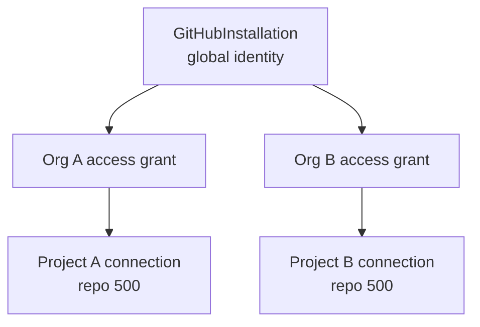

# Shared GitHub Installations

**Status:** Implemented (Phase 5B Extension)  
**Migration:** `019_shared_github_installations`  
**Related:** [Architecture audit](./SHARED_GITHUB_INSTALLATION_ARCHITECTURE_AUDIT.md), [Tenancy model](./GITHUB_INSTALLATION_TENANCY_MODEL.md), [Webhook routing](./GITHUB_WEBHOOK_MULTI_TENANT_ROUTING.md), [Security](./GITHUB_INSTALLATION_SECURITY_MODEL.md), [Migration notes](./SHARED_GITHUB_INSTALLATION_MIGRATION.md)

## What changed

A GitHub App installation is a **global identity**. DevGuard organizations receive independent **access grants**. Projects connect specific repositories under those grants.

One installation may be linked to:

- multiple projects in one organization;
- projects across different organizations;
- different repositories under the same GitHub App installation.

The previous rejection:

> This GitHub installation is already linked to another organization.

has been removed. Setup creates or reactivates an organization access grant instead.

## Layers

## Setup flow

1. Organization admin starts Install / setup (encrypted `state` binds org + project + user).
2. GitHub callback → `POST /integrations/github/setup`.
3. Backend upserts global installation + ACTIVE org access (never exclusive ownership conflict).
4. Admin selects repository → `POST /projects/{id}/integrations/github`.
5. Connection stores `installation_access_id`, `organization_id`, `project_id`, repo ids.

## API additions

| Method | Path | Purpose |
|--------|------|---------|
| POST | `/integrations/github/installations/{id}/sync` | Refresh repos for current org access |
| DELETE | `/integrations/github/installations/{id}/link` | Disconnect **this org only** |

Existing setup, list, repository, and project connection endpoints remain.

## Disconnect semantics

| Action | Effect |
|--------|--------|
| Disconnect project connection | Deactivates one project mapping |
| DELETE `.../link` | Deactivates org access + that org’s project connections |
| GitHub App uninstall/suspend | Installation unavailable globally; access grants marked unavailable; history kept |

One DevGuard organization cannot uninstall or revoke another organization’s access.

## Webhooks

One delivery fans out to every matching active repository connection. See [GITHUB_WEBHOOK_MULTI_TENANT_ROUTING.md](./GITHUB_WEBHOOK_MULTI_TENANT_ROUTING.md).
