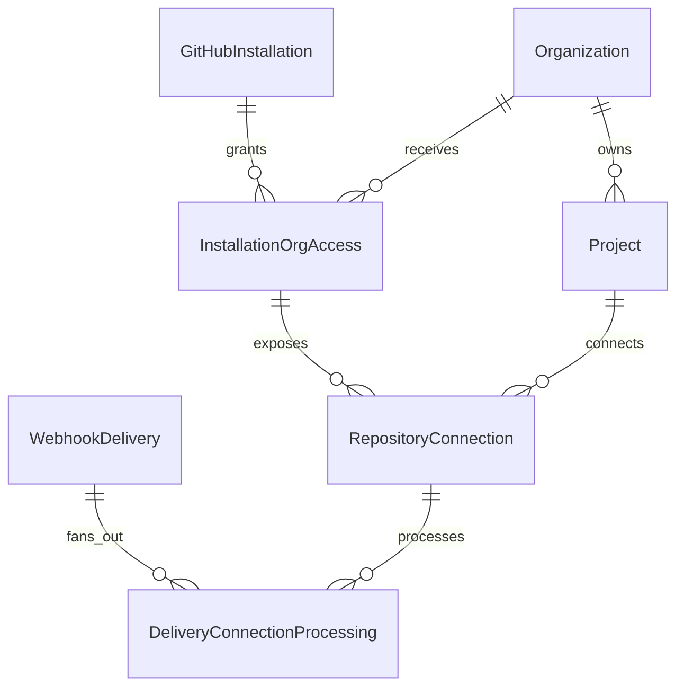
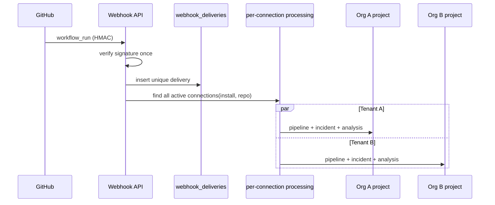

# Shared GitHub Installations — Architecture Audit

**Status:** Complete (Part 1 — no schema changes in this document)  
**Date:** 2026-08-02  
**Phase:** 5B Extension  
**Alembic head at audit time:** `018_phase6a6_verifiers`  
**Next migration (planned):** `019_shared_github_installations`  
**Authority:** Extends ADR-005; does not weaken tenant isolation

---

## 1. Executive summary

DevGuard AI currently treats a GitHub App **installation** as an exclusive organization resource:

1. `github_installations.organization_id` is **required**.
2. `uq_github_installations_github_installation_id` makes the GitHub numeric installation ID globally unique (one row = one org).
3. `GitHubSetupService.complete_setup` raises `INSTALLATION_ALREADY_LINKED` when another organization already owns that row.

That rejects a valid product need: one GitHub App installation (one GitHub account / org) used by **many DevGuard organizations and projects**, with **repository-scoped tenant isolation**.

The correct separation is:

| Layer | Meaning | Tenant boundary? |
|-------|---------|------------------|
| Global installation identity | External GitHub App installation | No |
| Organization access grant | Org may use that installation | Yes (org membership) |
| Project repository connection | Project watches a specific repo | Yes (org + project + connection) |

---

## 2. Current one-to-one restriction

### 2.1 Application rejection (primary UX error)

**File:** `backend/app/application/services/github_setup_service.py`  
**Method:** `GitHubSetupService.complete_setup`  
**Lines:** 193–203  
**HTTP:** 409 Conflict  
**Error code:** `INSTALLATION_ALREADY_LINKED`

```python
if existing is not None and existing.organization_id != organization_id:
    raise ConflictError(
        "This GitHub installation is already linked to another organization.",
        error_code="INSTALLATION_ALREADY_LINKED",
    )
```

Same-org re-completion is allowed (metadata refresh). Cross-org is hard-rejected.

### 2.2 Database backstop

| Constraint | Expression | Source |
|------------|------------|--------|
| `uq_github_installations_github_installation_id` | `(github_installation_id)` UNIQUE | ORM `github_installation.py` 36–39; migration `009_github_ingestion.py` 58–61 |

Even without the app check, a second org cannot insert a second row for the same GitHub installation ID.

### 2.3 Ownership column

`github_installations.organization_id`:

- NOT NULL
- FK → `organizations.id` ON DELETE CASCADE
- Indexed (`ix_github_installations_organization_id`)
- Used as the authoritative org scope for listing, loading, and webhook org denormalization

---

## 3. Current unique constraints (inventory)

| Name | Expression / predicate | Effect today |
|------|------------------------|--------------|
| `uq_github_installations_github_installation_id` | `(github_installation_id)` | One DB row per GitHub install → one org |
| `uq_github_connection_active_repository` | `(organization_id, github_repository_id) WHERE disconnected_at IS NULL` | One live connection per repo **within an org** |
| `uq_github_connection_active_project` | `(project_id) WHERE disconnected_at IS NULL` | One live GitHub connection **per project** |
| `uq_webhook_deliveries_provider_id` | `(provider, delivery_id)` | External delivery dedupe (keep) |
| `uq_pipeline_runs_project_provider_external_run` | `(project_id, provider, external_run_id) WHERE external_run_id IS NOT NULL` | Already **project-scoped** — safe for multi-org fan-out |

### Constraint changes required for shared installations

| Action | Constraint |
|--------|------------|
| Keep | Global uniqueness of `github_installation_id` on the **identity** table (still one global row per GitHub install) |
| Keep | `uq_webhook_deliveries_provider_id` |
| Keep | Project-scoped pipeline run uniqueness (already correct) |
| Soften / replace | App-level `INSTALLATION_ALREADY_LINKED` rejection |
| Soften ownership | Stop treating `github_installations.organization_id` as authoritative |
| Add | Unique `(installation_id, organization_id)` on access association |
| Evaluate | `uq_github_connection_active_repository` — keep org-scoped uniqueness (still valid); do **not** add global repo uniqueness |
| Evaluate | `uq_github_connection_active_project` — product currently allows one GitHub connection per project; retain unless UX expands |
| Add | Per-connection webhook processing uniqueness `(webhook_delivery_id, repository_connection_id)` |

---

## 4. Current data model inventory

### 4.1 `github_installations`

**ORM:** `backend/app/infrastructure/database/models/github_installation.py`  
**Created:** migration `009_github_ingestion`

| Column | Notes |
|--------|-------|
| `id` | UUID PK |
| `organization_id` | **Required ownership FK** (must be demoted) |
| `github_installation_id` | BigInteger, globally unique |
| `github_account_id` | Nullable |
| `github_account_login` | Required |
| `account_type` | Nullable |
| `status` | Default `active` |
| `permissions_json` | JSONB |
| `repository_selection` | Nullable |
| `installed_at` / `suspended_at` | Timestamps |
| `created_at` / `updated_at` | Mixins |

No encrypted installation token column today (tokens are ephemeral via provider).

### 4.2 `github_repository_connections`

**ORM:** `backend/app/infrastructure/database/models/github_repository_connection.py`

Scoped by `organization_id`, `project_id`, `github_installation_id` (FK to installation **row** UUID).  
No `installation_access_id` today.

### 4.3 `webhook_deliveries`

**ORM:** `backend/app/infrastructure/database/models/webhook_delivery.py`  
`organization_id` added in `010_phase5c_org_tenancy` (nullable, SET NULL).

Related outcome fields are **singular**:

- `related_pipeline_run_id`
- `related_incident_id`

These cannot represent multi-tenant fan-out without a child processing table.

### 4.4 No existing association table

There is **no** `github_installation_organization_access` (or equivalent).  
`project_integrations` is a generic metadata store and is not the App-install authority.

---

## 5. Current ownership assumptions (code)

| Assumption | Where enforced |
|------------|----------------|
| Installation belongs to exactly one org | `complete_setup` conflict + unique install id + required `organization_id` |
| List installations = filter by `organization_id` | `list_installations` |
| Load installation for org APIs | `_load_installation` — 404 if wrong org |
| Webhook delivery org = installation.organization_id | `WebhookDeliveryService.create_if_new` |
| Incident org = connection.organization_id | `GitHubIngestionService._get_or_create_incident` |
| One active connection per project | Partial unique + `create_connection` |
| One active connection per repo per org | Partial unique + `create_connection` |

### Critical fan-out gap

`GitHubIngestionService._find_connection` (`github_ingestion_service.py` ~259–273) selects **one** active connection by `github_repository_id` only (no org filter, no multi-row loop). Under today’s one-install→one-org model that is usually unique in practice; under shared installations it becomes **incorrect** (would process a single arbitrary tenant).

---

## 6. Current webhook routing assumptions

```
GitHub delivery
  → HMAC verify once
  → insert webhook_deliveries (unique provider+delivery_id)
  → resolve organization_id FROM github_installations.organization_id
  → process once
  → find ONE repository connection by repository_id
  → create ONE pipeline run + incident under that org/project
  → mark delivery completed
```

Implications for the new design:

1. Signature verification and external delivery uniqueness **remain once**.
2. Org resolution from installation ownership **must end**.
3. Processing must **fan out** to all matching active connections.
4. Delivery completion must account for **per-connection** outcomes (not one global success after first tenant).
5. Singular `related_*` FKs on `webhook_deliveries` are insufficient → add processing child rows.

Pipeline run uniqueness is already `(project_id, provider, external_run_id)` — **compatible** with multi-org fan-out (same GitHub run id may exist once per project).

---

## 7. Current repository synchronization assumptions

- No durable per-installation repository cache table.
- `list_repositories` calls the provider live using the installation’s numeric GitHub id, after `_load_installation` confirms org ownership.
- `test_connection` updates `last_successful_sync_at` on the **connection** only.
- Connected-repo badges are org-scoped (`organization_id` filter).

For shared installs: sync may refresh global installation metadata once, but visibility and “already connected” flags must remain **per organization access / project**.

---

## 8. Callback and existing-installation flows

| Endpoint | Role |
|----------|------|
| `POST /integrations/github/install-url` | Build GitHub App install URL + encrypted state |
| `GET|POST /integrations/github/setup` | `complete_setup` — **site of INSTALLATION_ALREADY_LINKED** |
| `GET /integrations/github/installations` | Org-owned installations only |
| `GET .../installations/{id}/repositories` | Repos for org-owned installation |
| `POST /projects/{id}/integrations/github` | Connect repo to project |

There is **no** dedicated “link existing installation to this organization” API. Frontend reuse path assumes the installation row already belongs to the current org.

Setup `state` already binds `organization_id` (+ optional `project_id`) and rejects cross-org state (`INTEGRATION_STATE_MISMATCH`). That binding must **remain** as the authorization proof for creating an access grant — guessing a numeric installation id alone must stay forbidden.

---

## 9. Provider / token assumptions

| Layer | Path |
|-------|------|
| Protocol | `backend/app/domain/interfaces/github_provider.py` |
| Factory | `backend/app/infrastructure/integrations/factory.py` |
| Real | `github_app_provider.py` |
| Fake | `fake_github_provider.py` |

Providers are org-agnostic (correct). Tokens are short-lived and not persisted (correct). Shared installations continue to mint tokens from the global installation id; **authorization must occur before** token use via access grant + repository connection.

---

## 10. Frontend surfaces

| Surface | Path |
|---------|------|
| Setup callback / selector | `frontend/src/pages/integrations/GitHubSetupCallbackPage.tsx` |
| Project GitHub page | `frontend/src/pages/integrations/GitHubIntegrationPage.tsx` |
| Integrations hub | `frontend/src/pages/integrations/ProjectIntegrationsPage.tsx` |
| API client | `frontend/src/api/integrationsApi.ts` |

Frontend displays the API conflict message; it does not re-implement ownership. UX must replace the hard error with link/reuse messaging and never list other tenants’ orgs/projects.

---

## 11. Test coverage gaps

| Area | Status |
|------|--------|
| `INSTALLATION_ALREADY_LINKED` | **No dedicated test** |
| Cross-org setup state | Covered (`INTEGRATION_STATE_MISMATCH`) |
| Unique install id constraint | Migration-only; no pytest asserting shared-org behavior |
| Multi-connection webhook fan-out | **Absent** (single `_find_connection`) |
| Per-connection delivery idempotency | **Absent** |

Regression suite must keep single-org happy path green while adding the Part 21–23 matrix.

---

## 12. Migration strategy (planned — not executed in Part 1)

**Revision:** `019_shared_github_installations`  
**down_revision:** `018_phase6a6_verifiers`  
**Style:** Additive-first, reversible where safe. No volume wipes.

### Steps

1. Create `github_installation_organization_access` with unique `(installation_id, organization_id)`.
2. Backfill: for every existing `github_installations` row with `organization_id`, insert one `ACTIVE` access grant (`linked_at = installed_at or created_at`).
3. Add nullable `installation_access_id` FK on `github_repository_connections`; backfill from installation + connection `organization_id`.
4. Create `webhook_delivery_connection_processing` with unique `(webhook_delivery_id, repository_connection_id)`.
5. Make `github_installations.organization_id` **nullable** (legacy metadata only); stop reading it for authorization after cutover.
6. Do **not** drop `organization_id` in 019 unless all code paths are switched and verified (prefer nullable legacy column in 019; drop in a later cleanup if desired).
7. Preserve all installations, connections, deliveries, pipeline runs, incidents.
8. Do not change `uq_pipeline_runs_project_provider_external_run` (already project-scoped).
9. Keep `uq_webhook_deliveries_provider_id`.

### Data migration requirements

| Source | Target |
|--------|--------|
| Each installation row | One access association for its current `organization_id` |
| Each live repository connection | `installation_access_id` pointing at that org’s access row |
| Historical deliveries / incidents | Untouched row data; new processing table empty until new webhooks |

### Downgrade (safe subset)

- Drop new tables / columns added by 019.
- Restore `organization_id` NOT NULL only if every installation still has a recoverable primary org (backfill from access table if present).
- Do not attempt to reconstruct exclusive ownership for installs that gained multiple access grants after upgrade.

---

## 13. Tenant-isolation risks

| Risk | Mitigation |
|------|------------|
| Webhook processes wrong/single tenant | Fan-out by connection; never authorize by installation id alone |
| Org A sees Org B’s projects via install list | List only current org’s **access grants**; never return other org names |
| Guessed installation UUID/numeric id linked | Require valid encrypted setup `state` / provider confirmation before grant |
| Shared token responses leak across tenants | Check connection + org membership before any GitHub API use; no cross-tenant caches keyed only by installation |
| Disconnect Org A uninstalls for Org B | Disconnect = deactivate **access grant** only; never call GitHub uninstall for peer orgs |
| Delivery marked complete after first tenant | Per-connection processing status; aggregate delivery status carefully |
| `_find_connection` scalar race | Replace with `find_all_connections` + independent transactions/units of work |
| CASCADE delete of org deletes shared installation | Installation row must **not** CASCADE-delete solely because one org is deleted; access FK should CASCADE, installation identity should RESTRICT/SET NULL on legacy org column |

---

## 14. Backwards compatibility

| Behavior | Compatibility plan |
|----------|-------------------|
| Single-org install + one project connection | Still works via one ACTIVE access grant |
| Existing setup state encryption | Unchanged |
| Existing webhook HMAC | Unchanged |
| Existing fake provider / e2e | Update fixtures to create access grants |
| API response shapes | Extend; avoid breaking required fields |
| `organization_id` on installation | Nullable legacy; omit from auth decisions |
| OpenAPI | Regenerate after endpoint updates |

---

## 15. Exact reuse plan

### Keep / reuse

- `GitHubProvider` protocol + App/Fake providers (token minting)
- Webhook signature module (`github_webhook_security.py`)
- Encrypted setup `state` as org-binding proof
- `github_event_filters` per connection automation settings
- Project-scoped pipeline run uniqueness
- External delivery uniqueness `(provider, delivery_id)`
- Org RBAC helpers (`require_org_admin` / `require_org_reader`)
- Frontend project integrations shell and repository selector patterns

### Change

- `GitHubSetupService.complete_setup` — create/reactivate access grant instead of conflict
- `list_installations` / `_load_installation` — join through access table
- `WebhookDeliveryService` org resolution — stop using installation.organization_id as sole org
- `GitHubIngestionService` — multi-connection fan-out + per-connection idempotency
- Connection create — set `installation_access_id`; allow same repo across orgs; keep per-org / per-project product rules
- Frontend setup copy — remove hard “already linked” dead-end

### Add

- ORM: `GitHubInstallationOrganizationAccess`
- ORM: `WebhookDeliveryConnectionProcessing` (or equivalent name per conventions)
- Service: installation access link / unlink / sync helpers (may live on `GitHubSetupService` initially)
- APIs: org-scoped link / unlink / sync as specified in the Phase 5B extension brief
- Docs: tenancy, webhook routing, security, migration guides (Parts 26)
- ADR amendment note under ADR-005

### Do not

- Create a separate GitHub App per DevGuard org
- Persist installation tokens in plaintext
- Expose other organizations using a shared installation
- Globally unique `github_repository_id` across DevGuard
- Delete historical webhook/incident/analysis data during migration
- Run `docker compose down -v`

---

## 16. Target logical model (implementation contract)



### Webhook fan-out (target)



---

## 17. Implementation order (post-audit)

Aligned with the approved commit structure:

1. **This audit** (committed separately)
2. Migration + ORM associations
3. Installation access service
4. Callback + existing-installation flow
5. Repository connection updates
6. Multi-tenant webhook routing
7. Per-connection idempotency
8. Authorization + disconnect behavior
9. Frontend setup UX
10. Tests
11. Documentation + OpenAPI
12. Quality closure

**Gate:** Schema/code changes begin only after this audit is accepted in-repo.

---

## 18. Audit conclusions

| Question | Answer |
|----------|--------|
| Root cause of rejection? | Explicit `INSTALLATION_ALREADY_LINKED` check + exclusive `organization_id` on installation + global unique install id row ownership |
| Is pipeline uniqueness already multi-tenant safe? | Yes — scoped by `project_id` |
| Is webhook delivery uniqueness still correct? | Yes for external dedupe; insufficient for per-tenant processing |
| Biggest risk? | `_find_connection` single-scalar + delivery marked complete for one org |
| Safe migration? | Additive association + backfill + nullable legacy `organization_id` |
| Next Alembic revision? | `019_shared_github_installations` after `018_phase6a6_verifiers` |

---

## 19. References

- `docs/ADR-005-AUTOMATED-GITHUB-INGESTION.md`
- `docs/PHASE5B_GITHUB_APP_SETUP.md`
- `docs/PHASE5B_LOCAL_GITHUB_SETUP.md`
- `docs/ARCHITECTURE_DECISION_LOG.md` (Phase 5C org tenancy notes)
- `backend/alembic/versions/009_github_ingestion.py`
- `backend/alembic/versions/010_phase5c_org_tenancy.py`
- `backend/app/application/services/github_setup_service.py`
- `backend/app/application/services/github_ingestion_service.py`
- `backend/app/application/services/webhook_delivery_service.py`
